# Projects and dependencies analysis

This document provides a comprehensive overview of the projects and their dependencies in the context of upgrading to .NETCoreApp,Version=v10.0.

## Table of Contents

- [Executive Summary](#executive-Summary)
  - [Highlevel Metrics](#highlevel-metrics)
  - [Projects Compatibility](#projects-compatibility)
  - [Package Compatibility](#package-compatibility)
  - [API Compatibility](#api-compatibility)
- [Aggregate NuGet packages details](#aggregate-nuget-packages-details)
- [Top API Migration Challenges](#top-api-migration-challenges)
  - [Technologies and Features](#technologies-and-features)
  - [Most Frequent API Issues](#most-frequent-api-issues)
- [Projects Relationship Graph](#projects-relationship-graph)
- [Project Details](#project-details)

  - [ApiGateways\Mobile.Bff.Shopping\aggregator\Mobile.Shopping.HttpAggregator.csproj](#apigatewaysmobilebffshoppingaggregatormobileshoppinghttpaggregatorcsproj)
  - [ApiGateways\Web.Bff.Shopping\aggregator\Web.Shopping.HttpAggregator.csproj](#apigatewayswebbffshoppingaggregatorwebshoppinghttpaggregatorcsproj)
  - [BuildingBlocks\Devspaces.Support\Devspaces.Support.csproj](#buildingblocksdevspacessupportdevspacessupportcsproj)
  - [BuildingBlocks\EventBus\EventBus.Tests\EventBus.Tests.csproj](#buildingblockseventbuseventbustestseventbustestscsproj)
  - [BuildingBlocks\EventBus\EventBus\EventBus.csproj](#buildingblockseventbuseventbuseventbuscsproj)
  - [BuildingBlocks\EventBus\EventBusRabbitMQ\EventBusRabbitMQ.csproj](#buildingblockseventbuseventbusrabbitmqeventbusrabbitmqcsproj)
  - [BuildingBlocks\EventBus\EventBusServiceBus\EventBusServiceBus.csproj](#buildingblockseventbuseventbusservicebuseventbusservicebuscsproj)
  - [BuildingBlocks\EventBus\IntegrationEventLogEF\IntegrationEventLogEF.csproj](#buildingblockseventbusintegrationeventlogefintegrationeventlogefcsproj)
  - [BuildingBlocks\WebHostCustomization\WebHost.Customization\WebHost.Customization.csproj](#buildingblockswebhostcustomizationwebhostcustomizationwebhostcustomizationcsproj)
  - [docker-compose.dcproj](#docker-composedcproj)
  - [Services\Basket\Basket.API\Basket.API.csproj](#servicesbasketbasketapibasketapicsproj)
  - [Services\Basket\Basket.FunctionalTests\Basket.FunctionalTests.csproj](#servicesbasketbasketfunctionaltestsbasketfunctionaltestscsproj)
  - [Services\Basket\Basket.UnitTests\Basket.UnitTests.csproj](#servicesbasketbasketunittestsbasketunittestscsproj)
  - [Services\Catalog\Catalog.API\Catalog.API.csproj](#servicescatalogcatalogapicatalogapicsproj)
  - [Services\Catalog\Catalog.FunctionalTests\Catalog.FunctionalTests.csproj](#servicescatalogcatalogfunctionaltestscatalogfunctionaltestscsproj)
  - [Services\Catalog\Catalog.UnitTests\Catalog.UnitTests.csproj](#servicescatalogcatalogunittestscatalogunittestscsproj)
  - [Services\Identity\Identity.API\Identity.API.csproj](#servicesidentityidentityapiidentityapicsproj)
  - [Services\Ordering\Ordering.API\Ordering.API.csproj](#servicesorderingorderingapiorderingapicsproj)
  - [Services\Ordering\Ordering.BackgroundTasks\Ordering.BackgroundTasks.csproj](#servicesorderingorderingbackgroundtasksorderingbackgroundtaskscsproj)
  - [Services\Ordering\Ordering.Domain\Ordering.Domain.csproj](#servicesorderingorderingdomainorderingdomaincsproj)
  - [Services\Ordering\Ordering.FunctionalTests\Ordering.FunctionalTests.csproj](#servicesorderingorderingfunctionaltestsorderingfunctionaltestscsproj)
  - [Services\Ordering\Ordering.Infrastructure\Ordering.Infrastructure.csproj](#servicesorderingorderinginfrastructureorderinginfrastructurecsproj)
  - [Services\Ordering\Ordering.SignalrHub\Ordering.SignalrHub.csproj](#servicesorderingorderingsignalrhuborderingsignalrhubcsproj)
  - [Services\Ordering\Ordering.UnitTests\Ordering.UnitTests.csproj](#servicesorderingorderingunittestsorderingunittestscsproj)
  - [Services\Payment\Payment.API\Payment.API.csproj](#servicespaymentpaymentapipaymentapicsproj)
  - [Services\Webhooks\Webhooks.API\Webhooks.API.csproj](#serviceswebhookswebhooksapiwebhooksapicsproj)
  - [Tests\Services\Application.FunctionalTests\Application.FunctionalTests.csproj](#testsservicesapplicationfunctionaltestsapplicationfunctionaltestscsproj)
  - [Web\WebhookClient\WebhookClient.csproj](#webwebhookclientwebhookclientcsproj)
  - [Web\WebMVC\WebMVC.csproj](#webwebmvcwebmvccsproj)
  - [Web\WebSPA\WebSPA.csproj](#webwebspawebspacsproj)
  - [Web\WebStatus\WebStatus.csproj](#webwebstatuswebstatuscsproj)


## Executive Summary

### Highlevel Metrics

| Metric | Count | Status |
| :--- | :---: | :--- |
| Total Projects | 31 | 0 require upgrade |
| Total NuGet Packages | 118 | All compatible |
| Total Code Files | 614 |  |
| Total Code Files with Incidents | 0 |  |
| Total Lines of Code | 30345 |  |
| Total Number of Issues | 0 |  |
| Estimated LOC to modify | 0+ | at least 0,0% of codebase |

### Projects Compatibility

| Project | Target Framework | Difficulty | Package Issues | API Issues | Est. LOC Impact | Description |
| :--- | :---: | :---: | :---: | :---: | :---: | :--- |
| [ApiGateways\Mobile.Bff.Shopping\aggregator\Mobile.Shopping.HttpAggregator.csproj](#apigatewaysmobilebffshoppingaggregatormobileshoppinghttpaggregatorcsproj) | net10.0 | ✅ None | 0 | 0 |  | AspNetCore, Sdk Style = True |
| [ApiGateways\Web.Bff.Shopping\aggregator\Web.Shopping.HttpAggregator.csproj](#apigatewayswebbffshoppingaggregatorwebshoppinghttpaggregatorcsproj) | net10.0 | ✅ None | 0 | 0 |  | AspNetCore, Sdk Style = True |
| [BuildingBlocks\Devspaces.Support\Devspaces.Support.csproj](#buildingblocksdevspacessupportdevspacessupportcsproj) | net10.0 | ✅ None | 0 | 0 |  | ClassLibrary, Sdk Style = True |
| [BuildingBlocks\EventBus\EventBus.Tests\EventBus.Tests.csproj](#buildingblockseventbuseventbustestseventbustestscsproj) | net10.0 | ✅ None | 0 | 0 |  | DotNetCoreApp, Sdk Style = True |
| [BuildingBlocks\EventBus\EventBus\EventBus.csproj](#buildingblockseventbuseventbuseventbuscsproj) | net10.0 | ✅ None | 0 | 0 |  | ClassLibrary, Sdk Style = True |
| [BuildingBlocks\EventBus\EventBusRabbitMQ\EventBusRabbitMQ.csproj](#buildingblockseventbuseventbusrabbitmqeventbusrabbitmqcsproj) | net10.0 | ✅ None | 0 | 0 |  | ClassLibrary, Sdk Style = True |
| [BuildingBlocks\EventBus\EventBusServiceBus\EventBusServiceBus.csproj](#buildingblockseventbuseventbusservicebuseventbusservicebuscsproj) | net10.0 | ✅ None | 0 | 0 |  | ClassLibrary, Sdk Style = True |
| [BuildingBlocks\EventBus\IntegrationEventLogEF\IntegrationEventLogEF.csproj](#buildingblockseventbusintegrationeventlogefintegrationeventlogefcsproj) | net10.0 | ✅ None | 0 | 0 |  | ClassLibrary, Sdk Style = True |
| [BuildingBlocks\WebHostCustomization\WebHost.Customization\WebHost.Customization.csproj](#buildingblockswebhostcustomizationwebhostcustomizationwebhostcustomizationcsproj) | net10.0 | ✅ None | 0 | 0 |  | ClassLibrary, Sdk Style = True |
| [docker-compose.dcproj](#docker-composedcproj) |  | ✅ None | 0 | 0 |  | DotNetCoreApp, Sdk Style = True |
| [Services\Basket\Basket.API\Basket.API.csproj](#servicesbasketbasketapibasketapicsproj) | net10.0 | ✅ None | 0 | 0 |  | AspNetCore, Sdk Style = True |
| [Services\Basket\Basket.FunctionalTests\Basket.FunctionalTests.csproj](#servicesbasketbasketfunctionaltestsbasketfunctionaltestscsproj) | net10.0 | ✅ None | 0 | 0 |  | DotNetCoreApp, Sdk Style = True |
| [Services\Basket\Basket.UnitTests\Basket.UnitTests.csproj](#servicesbasketbasketunittestsbasketunittestscsproj) | net10.0 | ✅ None | 0 | 0 |  | DotNetCoreApp, Sdk Style = True |
| [Services\Catalog\Catalog.API\Catalog.API.csproj](#servicescatalogcatalogapicatalogapicsproj) | net10.0 | ✅ None | 0 | 0 |  | AspNetCore, Sdk Style = True |
| [Services\Catalog\Catalog.FunctionalTests\Catalog.FunctionalTests.csproj](#servicescatalogcatalogfunctionaltestscatalogfunctionaltestscsproj) | net10.0 | ✅ None | 0 | 0 |  | DotNetCoreApp, Sdk Style = True |
| [Services\Catalog\Catalog.UnitTests\Catalog.UnitTests.csproj](#servicescatalogcatalogunittestscatalogunittestscsproj) | net10.0 | ✅ None | 0 | 0 |  | DotNetCoreApp, Sdk Style = True |
| [Services\Identity\Identity.API\Identity.API.csproj](#servicesidentityidentityapiidentityapicsproj) | net10.0 | ✅ None | 0 | 0 |  | AspNetCore, Sdk Style = True |
| [Services\Ordering\Ordering.API\Ordering.API.csproj](#servicesorderingorderingapiorderingapicsproj) | net10.0 | ✅ None | 0 | 0 |  | AspNetCore, Sdk Style = True |
| [Services\Ordering\Ordering.BackgroundTasks\Ordering.BackgroundTasks.csproj](#servicesorderingorderingbackgroundtasksorderingbackgroundtaskscsproj) | net10.0 | ✅ None | 0 | 0 |  | DotNetCoreApp, Sdk Style = True |
| [Services\Ordering\Ordering.Domain\Ordering.Domain.csproj](#servicesorderingorderingdomainorderingdomaincsproj) | net10.0 | ✅ None | 0 | 0 |  | ClassLibrary, Sdk Style = True |
| [Services\Ordering\Ordering.FunctionalTests\Ordering.FunctionalTests.csproj](#servicesorderingorderingfunctionaltestsorderingfunctionaltestscsproj) | net10.0 | ✅ None | 0 | 0 |  | DotNetCoreApp, Sdk Style = True |
| [Services\Ordering\Ordering.Infrastructure\Ordering.Infrastructure.csproj](#servicesorderingorderinginfrastructureorderinginfrastructurecsproj) | net10.0 | ✅ None | 0 | 0 |  | ClassLibrary, Sdk Style = True |
| [Services\Ordering\Ordering.SignalrHub\Ordering.SignalrHub.csproj](#servicesorderingorderingsignalrhuborderingsignalrhubcsproj) | net10.0 | ✅ None | 0 | 0 |  | AspNetCore, Sdk Style = True |
| [Services\Ordering\Ordering.UnitTests\Ordering.UnitTests.csproj](#servicesorderingorderingunittestsorderingunittestscsproj) | net10.0 | ✅ None | 0 | 0 |  | DotNetCoreApp, Sdk Style = True |
| [Services\Payment\Payment.API\Payment.API.csproj](#servicespaymentpaymentapipaymentapicsproj) | net10.0 | ✅ None | 0 | 0 |  | AspNetCore, Sdk Style = True |
| [Services\Webhooks\Webhooks.API\Webhooks.API.csproj](#serviceswebhookswebhooksapiwebhooksapicsproj) | net10.0 | ✅ None | 0 | 0 |  | AspNetCore, Sdk Style = True |
| [Tests\Services\Application.FunctionalTests\Application.FunctionalTests.csproj](#testsservicesapplicationfunctionaltestsapplicationfunctionaltestscsproj) | net10.0 | ✅ None | 0 | 0 |  | DotNetCoreApp, Sdk Style = True |
| [Web\WebhookClient\WebhookClient.csproj](#webwebhookclientwebhookclientcsproj) | net10.0 | ✅ None | 0 | 0 |  | AspNetCore, Sdk Style = True |
| [Web\WebMVC\WebMVC.csproj](#webwebmvcwebmvccsproj) | net10.0 | ✅ None | 0 | 0 |  | AspNetCore, Sdk Style = True |
| [Web\WebSPA\WebSPA.csproj](#webwebspawebspacsproj) | net10.0 | ✅ None | 0 | 0 |  | AspNetCore, Sdk Style = True |
| [Web\WebStatus\WebStatus.csproj](#webwebstatuswebstatuscsproj) | net10.0 | ✅ None | 0 | 0 |  | AspNetCore, Sdk Style = True |

### Package Compatibility

| Status | Count | Percentage |
| :--- | :---: | :---: |
| ✅ Compatible | 118 | 100,0% |
| ⚠️ Incompatible | 0 | 0,0% |
| 🔄 Upgrade Recommended | 0 | 0,0% |
| ***Total NuGet Packages*** | ***118*** | ***100%*** |

### API Compatibility

| Category | Count | Impact |
| :--- | :---: | :--- |
| 🔴 Binary Incompatible | 0 | High - Require code changes |
| 🟡 Source Incompatible | 0 | Medium - Needs re-compilation and potential conflicting API error fixing |
| 🔵 Behavioral change | 0 | Low - Behavioral changes that may require testing at runtime |
| ✅ Compatible | 0 |  |
| ***Total APIs Analyzed*** | ***0*** |  |

## Aggregate NuGet packages details

| Package | Current Version | Suggested Version | Projects | Description |
| :--- | :---: | :---: | :--- | :--- |
| AspNetCore.HealthChecks.AzureServiceBus | 8.0.0 |  | [Ordering.BackgroundTasks.csproj](#servicesorderingorderingbackgroundtasksorderingbackgroundtaskscsproj)<br/>[Ordering.SignalrHub.csproj](#servicesorderingorderingsignalrhuborderingsignalrhubcsproj)<br/>[Payment.API.csproj](#servicespaymentpaymentapipaymentapicsproj) | ✅Compatible |
| AspNetCore.HealthChecks.AzureServiceBus | 9.0.0 |  | [Basket.API.csproj](#servicesbasketbasketapibasketapicsproj)<br/>[Catalog.API.csproj](#servicescatalogcatalogapicatalogapicsproj)<br/>[Ordering.API.csproj](#servicesorderingorderingapiorderingapicsproj) | ✅Compatible |
| AspNetCore.HealthChecks.AzureStorage | 7.0.0 |  | [Catalog.API.csproj](#servicescatalogcatalogapicatalogapicsproj) | ✅Compatible |
| AspNetCore.HealthChecks.Rabbitmq | 8.0.0 |  | [Ordering.BackgroundTasks.csproj](#servicesorderingorderingbackgroundtasksorderingbackgroundtaskscsproj)<br/>[Ordering.SignalrHub.csproj](#servicesorderingorderingsignalrhuborderingsignalrhubcsproj)<br/>[Payment.API.csproj](#servicespaymentpaymentapipaymentapicsproj) | ✅Compatible |
| AspNetCore.HealthChecks.Rabbitmq | 8.0.2 |  | [Basket.API.csproj](#servicesbasketbasketapibasketapicsproj)<br/>[Catalog.API.csproj](#servicescatalogcatalogapicatalogapicsproj)<br/>[Ordering.API.csproj](#servicesorderingorderingapiorderingapicsproj) | ✅Compatible |
| AspNetCore.HealthChecks.Redis | 9.0.0 |  | [Basket.API.csproj](#servicesbasketbasketapibasketapicsproj) | ✅Compatible |
| AspNetCore.HealthChecks.SqlServer | 8.0.0 |  | [Ordering.BackgroundTasks.csproj](#servicesorderingorderingbackgroundtasksorderingbackgroundtaskscsproj)<br/>[Webhooks.API.csproj](#serviceswebhookswebhooksapiwebhooksapicsproj) | ✅Compatible |
| AspNetCore.HealthChecks.SqlServer | 9.0.0 |  | [Catalog.API.csproj](#servicescatalogcatalogapicatalogapicsproj)<br/>[Identity.API.csproj](#servicesidentityidentityapiidentityapicsproj)<br/>[Ordering.API.csproj](#servicesorderingorderingapiorderingapicsproj) | ✅Compatible |
| AspNetCore.HealthChecks.UI | 8.0.0 |  | [WebStatus.csproj](#webwebstatuswebstatuscsproj) | ✅Compatible |
| AspNetCore.HealthChecks.UI.Client | 8.0.0 |  | [Mobile.Shopping.HttpAggregator.csproj](#apigatewaysmobilebffshoppingaggregatormobileshoppinghttpaggregatorcsproj)<br/>[Ordering.BackgroundTasks.csproj](#servicesorderingorderingbackgroundtasksorderingbackgroundtaskscsproj)<br/>[Ordering.SignalrHub.csproj](#servicesorderingorderingsignalrhuborderingsignalrhubcsproj)<br/>[Payment.API.csproj](#servicespaymentpaymentapipaymentapicsproj)<br/>[Web.Shopping.HttpAggregator.csproj](#apigatewayswebbffshoppingaggregatorwebshoppinghttpaggregatorcsproj)<br/>[Webhooks.API.csproj](#serviceswebhookswebhooksapiwebhooksapicsproj)<br/>[WebMVC.csproj](#webwebmvcwebmvccsproj)<br/>[WebSPA.csproj](#webwebspawebspacsproj)<br/>[WebStatus.csproj](#webwebstatuswebstatuscsproj) | ✅Compatible |
| AspNetCore.HealthChecks.UI.Client | 9.0.0 |  | [Basket.API.csproj](#servicesbasketbasketapibasketapicsproj)<br/>[Catalog.API.csproj](#servicescatalogcatalogapicatalogapicsproj)<br/>[Identity.API.csproj](#servicesidentityidentityapiidentityapicsproj)<br/>[Ordering.API.csproj](#servicesorderingorderingapiorderingapicsproj) | ✅Compatible |
| AspNetCore.HealthChecks.UI.InMemory.Storage | 8.0.0 |  | [WebStatus.csproj](#webwebstatuswebstatuscsproj) | ✅Compatible |
| AspNetCore.HealthChecks.Uris | 8.0.0 |  | [Mobile.Shopping.HttpAggregator.csproj](#apigatewaysmobilebffshoppingaggregatormobileshoppinghttpaggregatorcsproj)<br/>[Web.Shopping.HttpAggregator.csproj](#apigatewayswebbffshoppingaggregatorwebshoppinghttpaggregatorcsproj)<br/>[WebMVC.csproj](#webwebmvcwebmvccsproj)<br/>[WebSPA.csproj](#webwebspawebspacsproj)<br/>[WebStatus.csproj](#webwebstatuswebstatuscsproj) | ✅Compatible |
| Autofac | 8.0.0 |  | [EventBusRabbitMQ.csproj](#buildingblockseventbuseventbusrabbitmqeventbusrabbitmqcsproj)<br/>[EventBusServiceBus.csproj](#buildingblockseventbuseventbusservicebuseventbusservicebuscsproj)<br/>[Ordering.BackgroundTasks.csproj](#servicesorderingorderingbackgroundtasksorderingbackgroundtaskscsproj) | ✅Compatible |
| Autofac.Extensions.DependencyInjection | 10.0.0 |  | [Basket.API.csproj](#servicesbasketbasketapibasketapicsproj)<br/>[Catalog.API.csproj](#servicescatalogcatalogapicatalogapicsproj)<br/>[Identity.API.csproj](#servicesidentityidentityapiidentityapicsproj)<br/>[Ordering.API.csproj](#servicesorderingorderingapiorderingapicsproj) | ✅Compatible |
| Autofac.Extensions.DependencyInjection | 9.0.0 |  | [Ordering.BackgroundTasks.csproj](#servicesorderingorderingbackgroundtasksorderingbackgroundtaskscsproj)<br/>[Ordering.SignalrHub.csproj](#servicesorderingorderingsignalrhuborderingsignalrhubcsproj)<br/>[Payment.API.csproj](#servicespaymentpaymentapipaymentapicsproj)<br/>[Webhooks.API.csproj](#serviceswebhookswebhooksapiwebhooksapicsproj) | ✅Compatible |
| Azure.Extensions.AspNetCore.Configuration.Secrets | 1.3.1 |  | [Payment.API.csproj](#servicespaymentpaymentapipaymentapicsproj)<br/>[WebStatus.csproj](#webwebstatuswebstatuscsproj) | ✅Compatible |
| Azure.Extensions.AspNetCore.Configuration.Secrets | 1.3.2 |  | [Basket.API.csproj](#servicesbasketbasketapibasketapicsproj)<br/>[Identity.API.csproj](#servicesidentityidentityapiidentityapicsproj)<br/>[Ordering.API.csproj](#servicesorderingorderingapiorderingapicsproj) | ✅Compatible |
| Azure.Identity | 1.17.1 |  | [Basket.API.csproj](#servicesbasketbasketapibasketapicsproj)<br/>[Catalog.API.csproj](#servicescatalogcatalogapicatalogapicsproj)<br/>[Identity.API.csproj](#servicesidentityidentityapiidentityapicsproj)<br/>[Ordering.API.csproj](#servicesorderingorderingapiorderingapicsproj)<br/>[Payment.API.csproj](#servicespaymentpaymentapipaymentapicsproj)<br/>[WebStatus.csproj](#webwebstatuswebstatuscsproj) | ✅Compatible |
| Azure.Messaging.ServiceBus | 7.17.4 |  | [EventBusServiceBus.csproj](#buildingblockseventbuseventbusservicebuseventbusservicebuscsproj) | ✅Compatible |
| BuildBundlerMinifier | 3.2.449 |  | [WebMVC.csproj](#webwebmvcwebmvccsproj) | ✅Compatible |
| Dapper | 2.1.37 |  | [Ordering.API.csproj](#servicesorderingorderingapiorderingapicsproj)<br/>[Ordering.BackgroundTasks.csproj](#servicesorderingorderingbackgroundtasksorderingbackgroundtaskscsproj) | ✅Compatible |
| Duende.IdentityServer | 7.0.10 |  | [Identity.API.csproj](#servicesidentityidentityapiidentityapicsproj) | ✅Compatible |
| Duende.IdentityServer.AspNetIdentity | 7.0.10 |  | [Identity.API.csproj](#servicesidentityidentityapiidentityapicsproj) | ✅Compatible |
| Duende.IdentityServer.EntityFramework | 7.0.10 |  | [Identity.API.csproj](#servicesidentityidentityapiidentityapicsproj) | ✅Compatible |
| Duende.IdentityServer.EntityFramework.Storage | 7.0.10 |  | [Identity.API.csproj](#servicesidentityidentityapiidentityapicsproj) | ✅Compatible |
| Duende.IdentityServer.Storage | 7.0.10 |  | [Identity.API.csproj](#servicesidentityidentityapiidentityapicsproj) | ✅Compatible |
| FluentValidation.AspNetCore | 11.3.0 |  | [Ordering.API.csproj](#servicesorderingorderingapiorderingapicsproj) | ✅Compatible |
| Google.Protobuf | 3.26.0 |  | [Mobile.Shopping.HttpAggregator.csproj](#apigatewaysmobilebffshoppingaggregatormobileshoppinghttpaggregatorcsproj)<br/>[Web.Shopping.HttpAggregator.csproj](#apigatewayswebbffshoppingaggregatorwebshoppinghttpaggregatorcsproj) | ✅Compatible |
| Google.Protobuf | 3.33.2 |  | [Basket.API.csproj](#servicesbasketbasketapibasketapicsproj)<br/>[Catalog.API.csproj](#servicescatalogcatalogapicatalogapicsproj)<br/>[Ordering.API.csproj](#servicesorderingorderingapiorderingapicsproj) | ✅Compatible |
| Grpc.AspNetCore.Server | 2.71.0 |  | [Basket.API.csproj](#servicesbasketbasketapibasketapicsproj)<br/>[Catalog.API.csproj](#servicescatalogcatalogapicatalogapicsproj)<br/>[Ordering.API.csproj](#servicesorderingorderingapiorderingapicsproj) | ✅Compatible |
| Grpc.AspNetCore.Server.ClientFactory | 2.61.0 |  | [Mobile.Shopping.HttpAggregator.csproj](#apigatewaysmobilebffshoppingaggregatormobileshoppinghttpaggregatorcsproj)<br/>[Web.Shopping.HttpAggregator.csproj](#apigatewayswebbffshoppingaggregatorwebshoppinghttpaggregatorcsproj) | ✅Compatible |
| Grpc.Core | 2.46.6 |  | [Mobile.Shopping.HttpAggregator.csproj](#apigatewaysmobilebffshoppingaggregatormobileshoppinghttpaggregatorcsproj)<br/>[Web.Shopping.HttpAggregator.csproj](#apigatewayswebbffshoppingaggregatorwebshoppinghttpaggregatorcsproj) | ✅Compatible |
| Grpc.Net.Client | 2.61.0 |  | [Web.Shopping.HttpAggregator.csproj](#apigatewayswebbffshoppingaggregatorwebshoppinghttpaggregatorcsproj) | ✅Compatible |
| Grpc.Net.ClientFactory | 2.61.0 |  | [Mobile.Shopping.HttpAggregator.csproj](#apigatewaysmobilebffshoppingaggregatormobileshoppinghttpaggregatorcsproj)<br/>[Web.Shopping.HttpAggregator.csproj](#apigatewayswebbffshoppingaggregatorwebshoppinghttpaggregatorcsproj) | ✅Compatible |
| Grpc.Tools | 2.62.0 |  | [Mobile.Shopping.HttpAggregator.csproj](#apigatewaysmobilebffshoppingaggregatormobileshoppinghttpaggregatorcsproj)<br/>[Web.Shopping.HttpAggregator.csproj](#apigatewayswebbffshoppingaggregatorwebshoppinghttpaggregatorcsproj) | ✅Compatible |
| Grpc.Tools | 2.76.0 |  | [Basket.API.csproj](#servicesbasketbasketapibasketapicsproj)<br/>[Catalog.API.csproj](#servicescatalogcatalogapicatalogapicsproj)<br/>[Ordering.API.csproj](#servicesorderingorderingapiorderingapicsproj) | ✅Compatible |
| IdentityModel | 7.0.0 |  | [Identity.API.csproj](#servicesidentityidentityapiidentityapicsproj) | ✅Compatible |
| MediatR | 12.2.0 |  | [Basket.UnitTests.csproj](#servicesbasketbasketunittestsbasketunittestscsproj) | ✅Compatible |
| MediatR | 13.1.0 |  | [Ordering.Domain.csproj](#servicesorderingorderingdomainorderingdomaincsproj) | ✅Compatible |
| MediatR | 13.1.2 |  | [Ordering.API.csproj](#servicesorderingorderingapiorderingapicsproj) | ✅Compatible |
| MediatR | 14.0.0 |  | [Ordering.Infrastructure.csproj](#servicesorderingorderinginfrastructureorderinginfrastructurecsproj)<br/>[Ordering.UnitTests.csproj](#servicesorderingorderingunittestsorderingunittestscsproj) | ✅Compatible |
| Microsoft.ApplicationInsights.AspNetCore | 2.22.0 |  | [Ordering.SignalrHub.csproj](#servicesorderingorderingsignalrhuborderingsignalrhubcsproj)<br/>[Payment.API.csproj](#servicespaymentpaymentapipaymentapicsproj)<br/>[Webhooks.API.csproj](#serviceswebhookswebhooksapiwebhooksapicsproj)<br/>[WebMVC.csproj](#webwebmvcwebmvccsproj)<br/>[WebSPA.csproj](#webwebspawebspacsproj)<br/>[WebStatus.csproj](#webwebstatuswebstatuscsproj) | ✅Compatible |
| Microsoft.ApplicationInsights.AspNetCore | 2.23.0 |  | [Basket.API.csproj](#servicesbasketbasketapibasketapicsproj)<br/>[Catalog.API.csproj](#servicescatalogcatalogapicatalogapicsproj)<br/>[Identity.API.csproj](#servicesidentityidentityapiidentityapicsproj)<br/>[Ordering.API.csproj](#servicesorderingorderingapiorderingapicsproj) | ✅Compatible |
| Microsoft.ApplicationInsights.DependencyCollector | 2.22.0 |  | [Ordering.SignalrHub.csproj](#servicesorderingorderingsignalrhuborderingsignalrhubcsproj)<br/>[Payment.API.csproj](#servicespaymentpaymentapipaymentapicsproj)<br/>[Webhooks.API.csproj](#serviceswebhookswebhooksapiwebhooksapicsproj)<br/>[WebMVC.csproj](#webwebmvcwebmvccsproj)<br/>[WebSPA.csproj](#webwebspawebspacsproj)<br/>[WebStatus.csproj](#webwebstatuswebstatuscsproj) | ✅Compatible |
| Microsoft.ApplicationInsights.DependencyCollector | 2.23.0 |  | [Basket.API.csproj](#servicesbasketbasketapibasketapicsproj)<br/>[Catalog.API.csproj](#servicescatalogcatalogapicatalogapicsproj)<br/>[Identity.API.csproj](#servicesidentityidentityapiidentityapicsproj)<br/>[Ordering.API.csproj](#servicesorderingorderingapiorderingapicsproj) | ✅Compatible |
| Microsoft.ApplicationInsights.Kubernetes | 6.1.2 |  | [Ordering.SignalrHub.csproj](#servicesorderingorderingsignalrhuborderingsignalrhubcsproj)<br/>[Payment.API.csproj](#servicespaymentpaymentapipaymentapicsproj)<br/>[Webhooks.API.csproj](#serviceswebhookswebhooksapiwebhooksapicsproj)<br/>[WebMVC.csproj](#webwebmvcwebmvccsproj)<br/>[WebSPA.csproj](#webwebspawebspacsproj)<br/>[WebStatus.csproj](#webwebstatuswebstatuscsproj) | ✅Compatible |
| Microsoft.ApplicationInsights.Kubernetes | 8.0.0 |  | [Basket.API.csproj](#servicesbasketbasketapibasketapicsproj)<br/>[Catalog.API.csproj](#servicescatalogcatalogapicatalogapicsproj)<br/>[Identity.API.csproj](#servicesidentityidentityapiidentityapicsproj)<br/>[Ordering.API.csproj](#servicesorderingorderingapiorderingapicsproj) | ✅Compatible |
| Microsoft.AspNet.WebApi.Client | 6.0.0 |  | [WebhookClient.csproj](#webwebhookclientwebhookclientcsproj) | ✅Compatible |
| Microsoft.AspNetCore.Authentication.JwtBearer | 8.0.3 |  | [Mobile.Shopping.HttpAggregator.csproj](#apigatewaysmobilebffshoppingaggregatormobileshoppinghttpaggregatorcsproj)<br/>[Web.Shopping.HttpAggregator.csproj](#apigatewayswebbffshoppingaggregatorwebshoppinghttpaggregatorcsproj)<br/>[WebMVC.csproj](#webwebmvcwebmvccsproj) | ✅Compatible |
| Microsoft.AspNetCore.Authentication.JwtBearer | 9.0.0 |  | [Basket.API.csproj](#servicesbasketbasketapibasketapicsproj)<br/>[Ordering.API.csproj](#servicesorderingorderingapiorderingapicsproj)<br/>[Ordering.SignalrHub.csproj](#servicesorderingorderingsignalrhuborderingsignalrhubcsproj)<br/>[Webhooks.API.csproj](#serviceswebhookswebhooksapiwebhooksapicsproj) | ✅Compatible |
| Microsoft.AspNetCore.Authentication.OpenIdConnect | 8.0.3 |  | [Mobile.Shopping.HttpAggregator.csproj](#apigatewaysmobilebffshoppingaggregatormobileshoppinghttpaggregatorcsproj)<br/>[Web.Shopping.HttpAggregator.csproj](#apigatewayswebbffshoppingaggregatorwebshoppinghttpaggregatorcsproj)<br/>[WebhookClient.csproj](#webwebhookclientwebhookclientcsproj)<br/>[WebMVC.csproj](#webwebmvcwebmvccsproj) | ✅Compatible |
| Microsoft.AspNetCore.Authentication.OpenIdConnect | 9.0.0 |  | [Basket.API.csproj](#servicesbasketbasketapibasketapicsproj)<br/>[Ordering.API.csproj](#servicesorderingorderingapiorderingapicsproj)<br/>[Ordering.SignalrHub.csproj](#servicesorderingorderingsignalrhuborderingsignalrhubcsproj)<br/>[Webhooks.API.csproj](#serviceswebhookswebhooksapiwebhooksapicsproj) | ✅Compatible |
| Microsoft.AspNetCore.Authorization | 8.0.11 |  | [Ordering.SignalrHub.csproj](#servicesorderingorderingsignalrhuborderingsignalrhubcsproj) | ✅Compatible |
| Microsoft.AspNetCore.DataProtection.StackExchangeRedis | 8.0.3 |  | [WebMVC.csproj](#webwebmvcwebmvccsproj)<br/>[WebSPA.csproj](#webwebspawebspacsproj) | ✅Compatible |
| Microsoft.AspNetCore.DataProtection.StackExchangeRedis | 9.0.0 |  | [Basket.FunctionalTests.csproj](#servicesbasketbasketfunctionaltestsbasketfunctionaltestscsproj)<br/>[Identity.API.csproj](#servicesidentityidentityapiidentityapicsproj) | ✅Compatible |
| Microsoft.AspNetCore.Diagnostics.EntityFrameworkCore | 9.0.0 |  | [Identity.API.csproj](#servicesidentityidentityapiidentityapicsproj) | ✅Compatible |
| Microsoft.AspNetCore.Diagnostics.HealthChecks | 2.2.0 |  | [Ordering.BackgroundTasks.csproj](#servicesorderingorderingbackgroundtasksorderingbackgroundtaskscsproj) | ✅Compatible |
| Microsoft.AspNetCore.HealthChecks | 1.0.0 |  | [Basket.API.csproj](#servicesbasketbasketapibasketapicsproj)<br/>[Catalog.API.csproj](#servicescatalogcatalogapicatalogapicsproj)<br/>[Identity.API.csproj](#servicesidentityidentityapiidentityapicsproj)<br/>[Ordering.API.csproj](#servicesorderingorderingapiorderingapicsproj)<br/>[Ordering.SignalrHub.csproj](#servicesorderingorderingsignalrhuborderingsignalrhubcsproj)<br/>[Webhooks.API.csproj](#serviceswebhookswebhooksapiwebhooksapicsproj)<br/>[WebMVC.csproj](#webwebmvcwebmvccsproj) | ✅Compatible |
| Microsoft.AspNetCore.Http.Abstractions | 2.2.0 |  | [Devspaces.Support.csproj](#buildingblocksdevspacessupportdevspacessupportcsproj) | ✅Compatible |
| Microsoft.AspNetCore.Identity.EntityFrameworkCore | 9.0.0 |  | [Identity.API.csproj](#servicesidentityidentityapiidentityapicsproj) | ✅Compatible |
| Microsoft.AspNetCore.Identity.UI | 9.0.0 |  | [Identity.API.csproj](#servicesidentityidentityapiidentityapicsproj) | ✅Compatible |
| Microsoft.AspNetCore.Mvc.NewtonsoftJson | 9.0.0 |  | [Basket.API.csproj](#servicesbasketbasketapibasketapicsproj)<br/>[Catalog.API.csproj](#servicescatalogcatalogapicatalogapicsproj) | ✅Compatible |
| Microsoft.AspNetCore.Mvc.Testing | 8.0.11 |  | [Basket.FunctionalTests.csproj](#servicesbasketbasketfunctionaltestsbasketfunctionaltestscsproj)<br/>[Basket.UnitTests.csproj](#servicesbasketbasketunittestsbasketunittestscsproj)<br/>[Catalog.FunctionalTests.csproj](#servicescatalogcatalogfunctionaltestscatalogfunctionaltestscsproj)<br/>[Ordering.FunctionalTests.csproj](#servicesorderingorderingfunctionaltestsorderingfunctionaltestscsproj) | ✅Compatible |
| Microsoft.AspNetCore.SignalR.StackExchangeRedis | 8.0.11 |  | [Ordering.SignalrHub.csproj](#servicesorderingorderingsignalrhuborderingsignalrhubcsproj) | ✅Compatible |
| Microsoft.AspNetCore.SpaServices.Extensions | 8.0.3 |  | [WebSPA.csproj](#webwebspawebspacsproj) | ✅Compatible |
| Microsoft.AspNetCore.TestHost | 8.0.11 |  | [Basket.FunctionalTests.csproj](#servicesbasketbasketfunctionaltestsbasketfunctionaltestscsproj)<br/>[Catalog.FunctionalTests.csproj](#servicescatalogcatalogfunctionaltestscatalogfunctionaltestscsproj)<br/>[Ordering.FunctionalTests.csproj](#servicesorderingorderingfunctionaltestsorderingfunctionaltestscsproj) | ✅Compatible |
| Microsoft.AspNetCore.TestHost | 8.0.3 |  | [Application.FunctionalTests.csproj](#testsservicesapplicationfunctionaltestsapplicationfunctionaltestscsproj) | ✅Compatible |
| Microsoft.Build.Utilities.Core | 17.9.5 |  | [WebMVC.csproj](#webwebmvcwebmvccsproj) | ✅Compatible |
| Microsoft.CSharp | 4.7.0 |  | [EventBusRabbitMQ.csproj](#buildingblockseventbuseventbusrabbitmqeventbusrabbitmqcsproj)<br/>[EventBusServiceBus.csproj](#buildingblockseventbuseventbusservicebuseventbusservicebuscsproj) | ✅Compatible |
| Microsoft.EntityFrameworkCore | 9.0.0 |  | [Identity.API.csproj](#servicesidentityidentityapiidentityapicsproj)<br/>[IntegrationEventLogEF.csproj](#buildingblockseventbusintegrationeventlogefintegrationeventlogefcsproj)<br/>[Ordering.Infrastructure.csproj](#servicesorderingorderinginfrastructureorderinginfrastructurecsproj)<br/>[WebHost.Customization.csproj](#buildingblockswebhostcustomizationwebhostcustomizationwebhostcustomizationcsproj) | ✅Compatible |
| Microsoft.EntityFrameworkCore.Design | 9.0.0 |  | [Identity.API.csproj](#servicesidentityidentityapiidentityapicsproj)<br/>[IntegrationEventLogEF.csproj](#buildingblockseventbusintegrationeventlogefintegrationeventlogefcsproj)<br/>[WebHost.Customization.csproj](#buildingblockswebhostcustomizationwebhostcustomizationwebhostcustomizationcsproj) | ✅Compatible |
| Microsoft.EntityFrameworkCore.InMemory | 8.0.11 |  | [Catalog.UnitTests.csproj](#servicescatalogcatalogunittestscatalogunittestscsproj) | ✅Compatible |
| Microsoft.EntityFrameworkCore.Proxies | 9.0.0 |  | [Catalog.API.csproj](#servicescatalogcatalogapicatalogapicsproj) | ✅Compatible |
| Microsoft.EntityFrameworkCore.Relational | 9.0.0 |  | [Identity.API.csproj](#servicesidentityidentityapiidentityapicsproj)<br/>[IntegrationEventLogEF.csproj](#buildingblockseventbusintegrationeventlogefintegrationeventlogefcsproj)<br/>[WebHost.Customization.csproj](#buildingblockswebhostcustomizationwebhostcustomizationwebhostcustomizationcsproj) | ✅Compatible |
| Microsoft.EntityFrameworkCore.SqlServer | 9.0.0 |  | [Catalog.API.csproj](#servicescatalogcatalogapicatalogapicsproj)<br/>[Identity.API.csproj](#servicesidentityidentityapiidentityapicsproj)<br/>[IntegrationEventLogEF.csproj](#buildingblockseventbusintegrationeventlogefintegrationeventlogefcsproj)<br/>[Ordering.Infrastructure.csproj](#servicesorderingorderinginfrastructureorderinginfrastructurecsproj)<br/>[WebHost.Customization.csproj](#buildingblockswebhostcustomizationwebhostcustomizationwebhostcustomizationcsproj) | ✅Compatible |
| Microsoft.EntityFrameworkCore.Tools | 9.0.0 |  | [Catalog.API.csproj](#servicescatalogcatalogapicatalogapicsproj) | ✅Compatible |
| Microsoft.Extensions.Configuration.AzureKeyVault | 3.1.24 |  | [Basket.API.csproj](#servicesbasketbasketapibasketapicsproj)<br/>[Catalog.API.csproj](#servicescatalogcatalogapicatalogapicsproj)<br/>[Identity.API.csproj](#servicesidentityidentityapiidentityapicsproj) | ✅Compatible |
| Microsoft.Extensions.Configuration.Binder | 9.0.0 |  | [WebHost.Customization.csproj](#buildingblockswebhostcustomizationwebhostcustomizationwebhostcustomizationcsproj) | ✅Compatible |
| Microsoft.Extensions.DependencyInjection.Abstractions | 8.0.1 |  | [Devspaces.Support.csproj](#buildingblocksdevspacessupportdevspacessupportcsproj) | ✅Compatible |
| Microsoft.Extensions.Diagnostics.HealthChecks | 8.0.3 |  | [Mobile.Shopping.HttpAggregator.csproj](#apigatewaysmobilebffshoppingaggregatormobileshoppinghttpaggregatorcsproj)<br/>[Web.Shopping.HttpAggregator.csproj](#apigatewayswebbffshoppingaggregatorwebshoppinghttpaggregatorcsproj) | ✅Compatible |
| Microsoft.Extensions.Hosting | 8.0.0 |  | [Ordering.BackgroundTasks.csproj](#servicesorderingorderingbackgroundtasksorderingbackgroundtaskscsproj) | ✅Compatible |
| Microsoft.Extensions.Http | 8.0.0 |  | [Devspaces.Support.csproj](#buildingblocksdevspacessupportdevspacessupportcsproj) | ✅Compatible |
| Microsoft.Extensions.Identity.Stores | 8.0.11 |  | [Basket.UnitTests.csproj](#servicesbasketbasketunittestsbasketunittestscsproj) | ✅Compatible |
| Microsoft.Extensions.Logging | 8.0.0 |  | [EventBusRabbitMQ.csproj](#buildingblockseventbuseventbusrabbitmqeventbusrabbitmqcsproj)<br/>[EventBusServiceBus.csproj](#buildingblockseventbuseventbusservicebuseventbusservicebuscsproj) | ✅Compatible |
| Microsoft.Extensions.Logging.Abstractions | 10.0.0 |  | [Ordering.Infrastructure.csproj](#servicesorderingorderinginfrastructureorderinginfrastructurecsproj) | ✅Compatible |
| Microsoft.Extensions.Logging.AzureAppServices | 8.0.3 |  | [WebMVC.csproj](#webwebmvcwebmvccsproj)<br/>[WebSPA.csproj](#webwebspawebspacsproj)<br/>[WebStatus.csproj](#webwebstatuswebstatuscsproj) | ✅Compatible |
| Microsoft.Extensions.Logging.AzureAppServices | 9.0.0 |  | [Basket.API.csproj](#servicesbasketbasketapibasketapicsproj)<br/>[Catalog.API.csproj](#servicescatalogcatalogapicatalogapicsproj)<br/>[Identity.API.csproj](#servicesidentityidentityapiidentityapicsproj)<br/>[Ordering.API.csproj](#servicesorderingorderingapiorderingapicsproj)<br/>[Ordering.SignalrHub.csproj](#servicesorderingorderingsignalrhuborderingsignalrhubcsproj)<br/>[Payment.API.csproj](#servicespaymentpaymentapipaymentapicsproj)<br/>[Webhooks.API.csproj](#serviceswebhookswebhooksapiwebhooksapicsproj) | ✅Compatible |
| Microsoft.NET.Test.Sdk | 17.11.0 |  | [Ordering.UnitTests.csproj](#servicesorderingorderingunittestsorderingunittestscsproj) | ✅Compatible |
| Microsoft.NET.Test.Sdk | 17.9.0 |  | [Application.FunctionalTests.csproj](#testsservicesapplicationfunctionaltestsapplicationfunctionaltestscsproj)<br/>[Basket.FunctionalTests.csproj](#servicesbasketbasketfunctionaltestsbasketfunctionaltestscsproj)<br/>[Basket.UnitTests.csproj](#servicesbasketbasketunittestsbasketunittestscsproj)<br/>[Catalog.FunctionalTests.csproj](#servicescatalogcatalogfunctionaltestscatalogfunctionaltestscsproj)<br/>[Catalog.UnitTests.csproj](#servicescatalogcatalogunittestscatalogunittestscsproj)<br/>[EventBus.Tests.csproj](#buildingblockseventbuseventbustestseventbustestscsproj)<br/>[Ordering.FunctionalTests.csproj](#servicesorderingorderingfunctionaltestsorderingfunctionaltestscsproj) | ✅Compatible |
| Microsoft.NETCore.Platforms | 7.0.4 |  | [Basket.UnitTests.csproj](#servicesbasketbasketunittestsbasketunittestscsproj)<br/>[Catalog.UnitTests.csproj](#servicescatalogcatalogunittestscatalogunittestscsproj)<br/>[Ordering.API.csproj](#servicesorderingorderingapiorderingapicsproj)<br/>[Ordering.UnitTests.csproj](#servicesorderingorderingunittestsorderingunittestscsproj)<br/>[WebHost.Customization.csproj](#buildingblockswebhostcustomizationwebhostcustomizationwebhostcustomizationcsproj) | ✅Compatible |
| Microsoft.VisualStudio.Web.CodeGeneration.Design | 8.0.2 |  | [WebhookClient.csproj](#webwebhookclientwebhookclientcsproj) | ✅Compatible |
| Moq | 4.20.70 |  | [Basket.FunctionalTests.csproj](#servicesbasketbasketfunctionaltestsbasketfunctionaltestscsproj)<br/>[Basket.UnitTests.csproj](#servicesbasketbasketunittestsbasketunittestscsproj)<br/>[Catalog.UnitTests.csproj](#servicescatalogcatalogunittestscatalogunittestscsproj) | ✅Compatible |
| Moq | 4.20.72 |  | [Ordering.UnitTests.csproj](#servicesorderingorderingunittestsorderingunittestscsproj) | ✅Compatible |
| Newtonsoft.Json | 13.0.3 |  | [WebSPA.csproj](#webwebspawebspacsproj) | ✅Compatible |
| Polly | 8.3.1 |  | [EventBusRabbitMQ.csproj](#buildingblockseventbuseventbusrabbitmqeventbusrabbitmqcsproj) | ✅Compatible |
| Polly | 8.6.0 |  | [Identity.API.csproj](#servicesidentityidentityapiidentityapicsproj)<br/>[Ordering.API.csproj](#servicesorderingorderingapiorderingapicsproj)<br/>[WebHost.Customization.csproj](#buildingblockswebhostcustomizationwebhostcustomizationwebhostcustomizationcsproj) | ✅Compatible |
| RabbitMQ.Client | 6.8.1 |  | [EventBusRabbitMQ.csproj](#buildingblockseventbuseventbusrabbitmqeventbusrabbitmqcsproj) | ✅Compatible |
| Serilog.AspNetCore | 8.0.1 |  | [Mobile.Shopping.HttpAggregator.csproj](#apigatewaysmobilebffshoppingaggregatormobileshoppinghttpaggregatorcsproj)<br/>[Web.Shopping.HttpAggregator.csproj](#apigatewayswebbffshoppingaggregatorwebshoppinghttpaggregatorcsproj)<br/>[WebMVC.csproj](#webwebmvcwebmvccsproj)<br/>[WebSPA.csproj](#webwebspawebspacsproj)<br/>[WebStatus.csproj](#webwebstatuswebstatuscsproj) | ✅Compatible |
| Serilog.AspNetCore | 9.0.0 |  | [Basket.API.csproj](#servicesbasketbasketapibasketapicsproj)<br/>[Catalog.API.csproj](#servicescatalogcatalogapicatalogapicsproj)<br/>[Identity.API.csproj](#servicesidentityidentityapiidentityapicsproj)<br/>[Ordering.API.csproj](#servicesorderingorderingapiorderingapicsproj)<br/>[Ordering.BackgroundTasks.csproj](#servicesorderingorderingbackgroundtasksorderingbackgroundtaskscsproj)<br/>[Ordering.SignalrHub.csproj](#servicesorderingorderingsignalrhuborderingsignalrhubcsproj)<br/>[Payment.API.csproj](#servicespaymentpaymentapipaymentapicsproj) | ✅Compatible |
| Serilog.Enrichers.Environment | 2.3.0 |  | [Ordering.BackgroundTasks.csproj](#servicesorderingorderingbackgroundtasksorderingbackgroundtaskscsproj)<br/>[Ordering.SignalrHub.csproj](#servicesorderingorderingsignalrhuborderingsignalrhubcsproj)<br/>[WebMVC.csproj](#webwebmvcwebmvccsproj)<br/>[WebStatus.csproj](#webwebstatuswebstatuscsproj) | ✅Compatible |
| Serilog.Enrichers.Environment | 3.0.1 |  | [Basket.API.csproj](#servicesbasketbasketapibasketapicsproj)<br/>[Catalog.API.csproj](#servicescatalogcatalogapicatalogapicsproj)<br/>[Identity.API.csproj](#servicesidentityidentityapiidentityapicsproj)<br/>[Ordering.API.csproj](#servicesorderingorderingapiorderingapicsproj)<br/>[Payment.API.csproj](#servicespaymentpaymentapipaymentapicsproj) | ✅Compatible |
| Serilog.Settings.Configuration | 9.0.0 |  | [Basket.API.csproj](#servicesbasketbasketapibasketapicsproj)<br/>[Catalog.API.csproj](#servicescatalogcatalogapicatalogapicsproj)<br/>[Identity.API.csproj](#servicesidentityidentityapiidentityapicsproj)<br/>[Ordering.API.csproj](#servicesorderingorderingapiorderingapicsproj)<br/>[Ordering.BackgroundTasks.csproj](#servicesorderingorderingbackgroundtasksorderingbackgroundtaskscsproj)<br/>[Ordering.SignalrHub.csproj](#servicesorderingorderingsignalrhuborderingsignalrhubcsproj)<br/>[Payment.API.csproj](#servicespaymentpaymentapipaymentapicsproj)<br/>[WebMVC.csproj](#webwebmvcwebmvccsproj)<br/>[WebStatus.csproj](#webwebstatuswebstatuscsproj) | ✅Compatible |
| Serilog.Sinks.Console | 6.0.0 |  | [Basket.API.csproj](#servicesbasketbasketapibasketapicsproj)<br/>[Catalog.API.csproj](#servicescatalogcatalogapicatalogapicsproj)<br/>[Identity.API.csproj](#servicesidentityidentityapiidentityapicsproj)<br/>[Mobile.Shopping.HttpAggregator.csproj](#apigatewaysmobilebffshoppingaggregatormobileshoppinghttpaggregatorcsproj)<br/>[Ordering.API.csproj](#servicesorderingorderingapiorderingapicsproj)<br/>[Ordering.BackgroundTasks.csproj](#servicesorderingorderingbackgroundtasksorderingbackgroundtaskscsproj)<br/>[Ordering.SignalrHub.csproj](#servicesorderingorderingsignalrhuborderingsignalrhubcsproj)<br/>[Payment.API.csproj](#servicespaymentpaymentapipaymentapicsproj)<br/>[Web.Shopping.HttpAggregator.csproj](#apigatewayswebbffshoppingaggregatorwebshoppinghttpaggregatorcsproj)<br/>[WebMVC.csproj](#webwebmvcwebmvccsproj)<br/>[WebSPA.csproj](#webwebspawebspacsproj)<br/>[WebStatus.csproj](#webwebstatuswebstatuscsproj) | ✅Compatible |
| Serilog.Sinks.Http | 8.0.0 |  | [Ordering.BackgroundTasks.csproj](#servicesorderingorderingbackgroundtasksorderingbackgroundtaskscsproj)<br/>[Ordering.SignalrHub.csproj](#servicesorderingorderingsignalrhuborderingsignalrhubcsproj)<br/>[Payment.API.csproj](#servicespaymentpaymentapipaymentapicsproj)<br/>[WebMVC.csproj](#webwebmvcwebmvccsproj)<br/>[WebStatus.csproj](#webwebstatuswebstatuscsproj) | ✅Compatible |
| Serilog.Sinks.Http | 9.2.0 |  | [Basket.API.csproj](#servicesbasketbasketapibasketapicsproj)<br/>[Catalog.API.csproj](#servicescatalogcatalogapicatalogapicsproj)<br/>[Identity.API.csproj](#servicesidentityidentityapiidentityapicsproj)<br/>[Ordering.API.csproj](#servicesorderingorderingapiorderingapicsproj) | ✅Compatible |
| Serilog.Sinks.Seq | 7.0.0 |  | [Ordering.BackgroundTasks.csproj](#servicesorderingorderingbackgroundtasksorderingbackgroundtaskscsproj)<br/>[Ordering.SignalrHub.csproj](#servicesorderingorderingsignalrhuborderingsignalrhubcsproj)<br/>[Payment.API.csproj](#servicespaymentpaymentapipaymentapicsproj)<br/>[WebMVC.csproj](#webwebmvcwebmvccsproj)<br/>[WebSPA.csproj](#webwebspawebspacsproj)<br/>[WebStatus.csproj](#webwebstatuswebstatuscsproj) | ✅Compatible |
| Serilog.Sinks.Seq | 9.0.0 |  | [Basket.API.csproj](#servicesbasketbasketapibasketapicsproj)<br/>[Catalog.API.csproj](#servicescatalogcatalogapicatalogapicsproj)<br/>[Identity.API.csproj](#servicesidentityidentityapiidentityapicsproj)<br/>[Ordering.API.csproj](#servicesorderingorderingapiorderingapicsproj) | ✅Compatible |
| Swashbuckle.AspNetCore | 6.5.0 |  | [Mobile.Shopping.HttpAggregator.csproj](#apigatewaysmobilebffshoppingaggregatormobileshoppinghttpaggregatorcsproj)<br/>[Web.Shopping.HttpAggregator.csproj](#apigatewayswebbffshoppingaggregatorwebshoppinghttpaggregatorcsproj)<br/>[Webhooks.API.csproj](#serviceswebhookswebhooksapiwebhooksapicsproj) | ✅Compatible |
| Swashbuckle.AspNetCore | 6.9.0 |  | [Basket.API.csproj](#servicesbasketbasketapibasketapicsproj)<br/>[Catalog.API.csproj](#servicescatalogcatalogapicatalogapicsproj)<br/>[Identity.API.csproj](#servicesidentityidentityapiidentityapicsproj)<br/>[Ordering.API.csproj](#servicesorderingorderingapiorderingapicsproj) | ✅Compatible |
| Swashbuckle.AspNetCore.Newtonsoft | 6.9.0 |  | [Basket.API.csproj](#servicesbasketbasketapibasketapicsproj)<br/>[Catalog.API.csproj](#servicescatalogcatalogapicatalogapicsproj)<br/>[Identity.API.csproj](#servicesidentityidentityapiidentityapicsproj)<br/>[Ordering.API.csproj](#servicesorderingorderingapiorderingapicsproj) | ✅Compatible |
| System.Data.SqlClient | 4.8.6 |  | [Ordering.BackgroundTasks.csproj](#servicesorderingorderingbackgroundtasksorderingbackgroundtaskscsproj) | ✅Compatible |
| System.Data.SqlClient | 4.9.0 |  | [Catalog.API.csproj](#servicescatalogcatalogapicatalogapicsproj)<br/>[Identity.API.csproj](#servicesidentityidentityapiidentityapicsproj)<br/>[WebHost.Customization.csproj](#buildingblockswebhostcustomizationwebhostcustomizationwebhostcustomizationcsproj) | ✅Compatible |
| System.IdentityModel.Tokens.Jwt | 8.15.0 |  | [Basket.API.csproj](#servicesbasketbasketapibasketapicsproj)<br/>[Catalog.API.csproj](#servicescatalogcatalogapicatalogapicsproj) | ✅Compatible |
| xunit | 2.7.0 |  | [Application.FunctionalTests.csproj](#testsservicesapplicationfunctionaltestsapplicationfunctionaltestscsproj)<br/>[Basket.FunctionalTests.csproj](#servicesbasketbasketfunctionaltestsbasketfunctionaltestscsproj)<br/>[Basket.UnitTests.csproj](#servicesbasketbasketunittestsbasketunittestscsproj)<br/>[Catalog.FunctionalTests.csproj](#servicescatalogcatalogfunctionaltestscatalogfunctionaltestscsproj)<br/>[Catalog.UnitTests.csproj](#servicescatalogcatalogunittestscatalogunittestscsproj)<br/>[EventBus.Tests.csproj](#buildingblockseventbuseventbustestseventbustestscsproj)<br/>[Ordering.FunctionalTests.csproj](#servicesorderingorderingfunctionaltestsorderingfunctionaltestscsproj) | ✅Compatible |
| xunit | 2.9.3 |  | [Ordering.UnitTests.csproj](#servicesorderingorderingunittestsorderingunittestscsproj) | ✅Compatible |
| xunit.runner.visualstudio | 2.5.7 |  | [Application.FunctionalTests.csproj](#testsservicesapplicationfunctionaltestsapplicationfunctionaltestscsproj)<br/>[Basket.FunctionalTests.csproj](#servicesbasketbasketfunctionaltestsbasketfunctionaltestscsproj)<br/>[Basket.UnitTests.csproj](#servicesbasketbasketunittestsbasketunittestscsproj)<br/>[Catalog.FunctionalTests.csproj](#servicescatalogcatalogfunctionaltestscatalogfunctionaltestscsproj)<br/>[Catalog.UnitTests.csproj](#servicescatalogcatalogunittestscatalogunittestscsproj)<br/>[EventBus.Tests.csproj](#buildingblockseventbuseventbustestseventbustestscsproj)<br/>[Ordering.FunctionalTests.csproj](#servicesorderingorderingfunctionaltestsorderingfunctionaltestscsproj) | ✅Compatible |
| xunit.runner.visualstudio | 2.8.2 |  | [Ordering.UnitTests.csproj](#servicesorderingorderingunittestsorderingunittestscsproj) | ✅Compatible |

## Top API Migration Challenges

### Technologies and Features

| Technology | Issues | Percentage | Migration Path |
| :--- | :---: | :---: | :--- |

### Most Frequent API Issues

| API | Count | Percentage | Category |
| :--- | :---: | :---: | :--- |

## Projects Relationship Graph

Legend:
📦 SDK-style project
⚙️ Classic project

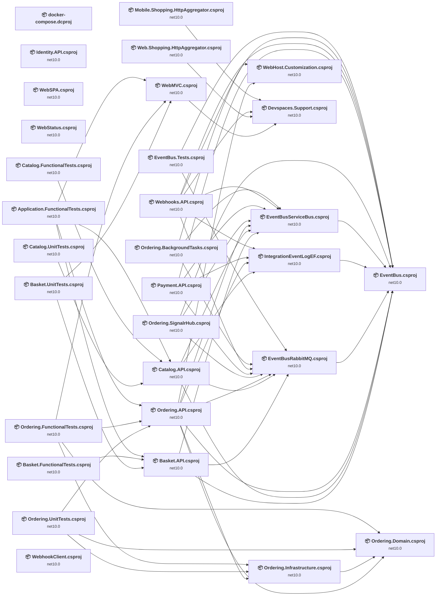

## Project Details

<a id="apigatewaysmobilebffshoppingaggregatormobileshoppinghttpaggregatorcsproj"></a>
### ApiGateways\Mobile.Bff.Shopping\aggregator\Mobile.Shopping.HttpAggregator.csproj

#### Project Info

- **Current Target Framework:** net10.0✅
- **SDK-style**: True
- **Project Kind:** AspNetCore
- **Dependencies**: 1
- **Dependants**: 0
- **Number of Files**: 30
- **Lines of Code**: 1045
- **Estimated LOC to modify**: 0+ (at least 0,0% of the project)

#### Dependency Graph

Legend:
📦 SDK-style project
⚙️ Classic project

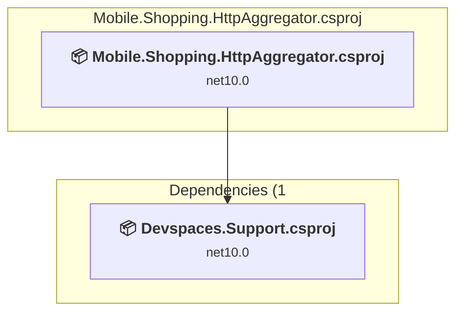

### API Compatibility

| Category | Count | Impact |
| :--- | :---: | :--- |
| 🔴 Binary Incompatible | 0 | High - Require code changes |
| 🟡 Source Incompatible | 0 | Medium - Needs re-compilation and potential conflicting API error fixing |
| 🔵 Behavioral change | 0 | Low - Behavioral changes that may require testing at runtime |
| ✅ Compatible | 0 |  |
| ***Total APIs Analyzed*** | ***0*** |  |

<a id="apigatewayswebbffshoppingaggregatorwebshoppinghttpaggregatorcsproj"></a>
### ApiGateways\Web.Bff.Shopping\aggregator\Web.Shopping.HttpAggregator.csproj

#### Project Info

- **Current Target Framework:** net10.0✅
- **SDK-style**: True
- **Project Kind:** AspNetCore
- **Dependencies**: 1
- **Dependants**: 0
- **Number of Files**: 31
- **Lines of Code**: 1062
- **Estimated LOC to modify**: 0+ (at least 0,0% of the project)

#### Dependency Graph

Legend:
📦 SDK-style project
⚙️ Classic project

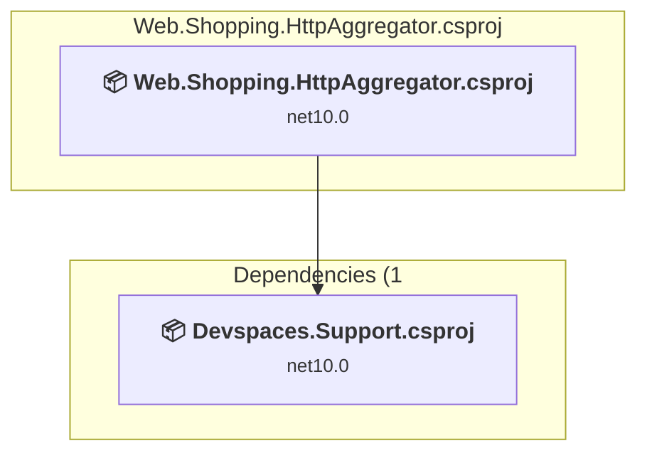

### API Compatibility

| Category | Count | Impact |
| :--- | :---: | :--- |
| 🔴 Binary Incompatible | 0 | High - Require code changes |
| 🟡 Source Incompatible | 0 | Medium - Needs re-compilation and potential conflicting API error fixing |
| 🔵 Behavioral change | 0 | Low - Behavioral changes that may require testing at runtime |
| ✅ Compatible | 0 |  |
| ***Total APIs Analyzed*** | ***0*** |  |

<a id="buildingblocksdevspacessupportdevspacessupportcsproj"></a>
### BuildingBlocks\Devspaces.Support\Devspaces.Support.csproj

#### Project Info

- **Current Target Framework:** net10.0✅
- **SDK-style**: True
- **Project Kind:** ClassLibrary
- **Dependencies**: 0
- **Dependants**: 4
- **Number of Files**: 4
- **Lines of Code**: 48
- **Estimated LOC to modify**: 0+ (at least 0,0% of the project)

#### Dependency Graph

Legend:
📦 SDK-style project
⚙️ Classic project

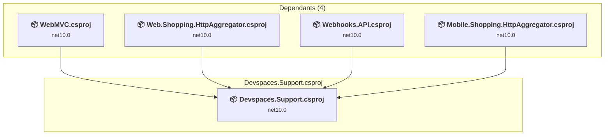

### API Compatibility

| Category | Count | Impact |
| :--- | :---: | :--- |
| 🔴 Binary Incompatible | 0 | High - Require code changes |
| 🟡 Source Incompatible | 0 | Medium - Needs re-compilation and potential conflicting API error fixing |
| 🔵 Behavioral change | 0 | Low - Behavioral changes that may require testing at runtime |
| ✅ Compatible | 0 |  |
| ***Total APIs Analyzed*** | ***0*** |  |

<a id="buildingblockseventbuseventbustestseventbustestscsproj"></a>
### BuildingBlocks\EventBus\EventBus.Tests\EventBus.Tests.csproj

#### Project Info

- **Current Target Framework:** net10.0✅
- **SDK-style**: True
- **Project Kind:** DotNetCoreApp
- **Dependencies**: 2
- **Dependants**: 0
- **Number of Files**: 6
- **Lines of Code**: 113
- **Estimated LOC to modify**: 0+ (at least 0,0% of the project)

#### Dependency Graph

Legend:
📦 SDK-style project
⚙️ Classic project

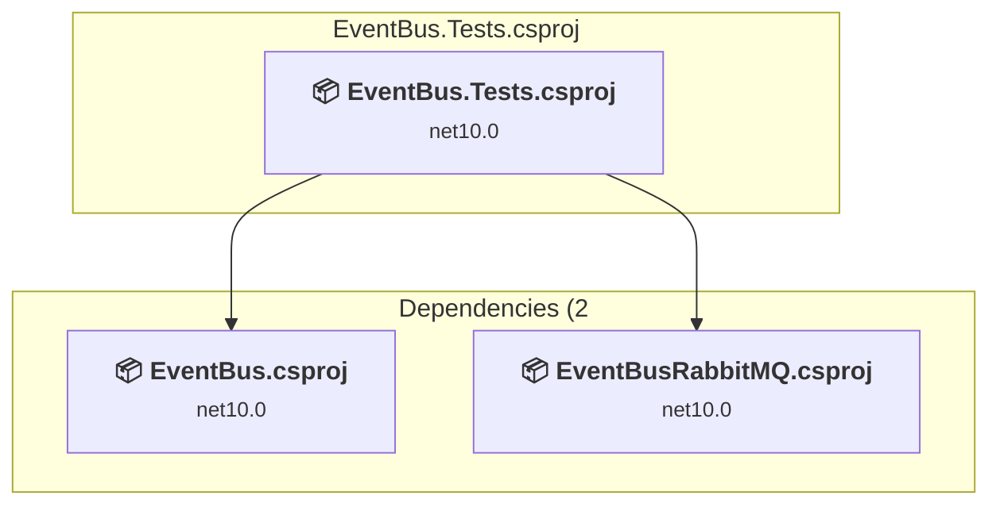

### API Compatibility

| Category | Count | Impact |
| :--- | :---: | :--- |
| 🔴 Binary Incompatible | 0 | High - Require code changes |
| 🟡 Source Incompatible | 0 | Medium - Needs re-compilation and potential conflicting API error fixing |
| 🔵 Behavioral change | 0 | Low - Behavioral changes that may require testing at runtime |
| ✅ Compatible | 0 |  |
| ***Total APIs Analyzed*** | ***0*** |  |

<a id="buildingblockseventbuseventbuseventbuscsproj"></a>
### BuildingBlocks\EventBus\EventBus\EventBus.csproj

#### Project Info

- **Current Target Framework:** net10.0✅
- **SDK-style**: True
- **Project Kind:** ClassLibrary
- **Dependencies**: 0
- **Dependants**: 11
- **Number of Files**: 9
- **Lines of Code**: 298
- **Estimated LOC to modify**: 0+ (at least 0,0% of the project)

#### Dependency Graph

Legend:
📦 SDK-style project
⚙️ Classic project

```mermaid
flowchart TB
    subgraph upstream["Dependants (11)"]
        P2["<b>📦&nbsp;Basket.API.csproj</b><br/><small>net10.0</small>"]
        P3["<b>📦&nbsp;Catalog.API.csproj</b><br/><small>net10.0</small>"]
        P4["<b>📦&nbsp;Ordering.API.csproj</b><br/><small>net10.0</small>"]
        P11["<b>📦&nbsp;EventBusRabbitMQ.csproj</b><br/><small>net10.0</small>"]
        P12["<b>📦&nbsp;IntegrationEventLogEF.csproj</b><br/><small>net10.0</small>"]
        P14["<b>📦&nbsp;EventBusServiceBus.csproj</b><br/><small>net10.0</small>"]
        P17["<b>📦&nbsp;Ordering.SignalrHub.csproj</b><br/><small>net10.0</small>"]
        P25["<b>📦&nbsp;Payment.API.csproj</b><br/><small>net10.0</small>"]
        P26["<b>📦&nbsp;Webhooks.API.csproj</b><br/><small>net10.0</small>"]
        P29["<b>📦&nbsp;Ordering.BackgroundTasks.csproj</b><br/><small>net10.0</small>"]
        P31["<b>📦&nbsp;EventBus.Tests.csproj</b><br/><small>net10.0</small>"]
        click P2 "#servicesbasketbasketapibasketapicsproj"
        click P3 "#servicescatalogcatalogapicatalogapicsproj"
        click P4 "#servicesorderingorderingapiorderingapicsproj"
        click P11 "#buildingblockseventbuseventbusrabbitmqeventbusrabbitmqcsproj"
        click P12 "#buildingblockseventbusintegrationeventlogefintegrationeventlogefcsproj"
        click P14 "#buildingblockseventbuseventbusservicebuseventbusservicebuscsproj"
        click P17 "#servicesorderingorderingsignalrhuborderingsignalrhubcsproj"
        click P25 "#servicespaymentpaymentapipaymentapicsproj"
        click P26 "#serviceswebhookswebhooksapiwebhooksapicsproj"
        click P29 "#servicesorderingorderingbackgroundtasksorderingbackgroundtaskscsproj"
        click P31 "#buildingblockseventbuseventbustestseventbustestscsproj"
    end
    subgraph current["EventBus.csproj"]
        MAIN["<b>📦&nbsp;EventBus.csproj</b><br/><small>net10.0</small>"]
        click MAIN "#buildingblockseventbuseventbuseventbuscsproj"
    end
    P2 --> MAIN
    P3 --> MAIN
    P4 --> MAIN
    P11 --> MAIN
    P12 --> MAIN
    P14 --> MAIN
    P17 --> MAIN
    P25 --> MAIN
    P26 --> MAIN
    P29 --> MAIN
    P31 --> MAIN

```

### API Compatibility

| Category | Count | Impact |
| :--- | :---: | :--- |
| 🔴 Binary Incompatible | 0 | High - Require code changes |
| 🟡 Source Incompatible | 0 | Medium - Needs re-compilation and potential conflicting API error fixing |
| 🔵 Behavioral change | 0 | Low - Behavioral changes that may require testing at runtime |
| ✅ Compatible | 0 |  |
| ***Total APIs Analyzed*** | ***0*** |  |

<a id="buildingblockseventbuseventbusrabbitmqeventbusrabbitmqcsproj"></a>
### BuildingBlocks\EventBus\EventBusRabbitMQ\EventBusRabbitMQ.csproj

#### Project Info

- **Current Target Framework:** net10.0✅
- **SDK-style**: True
- **Project Kind:** ClassLibrary
- **Dependencies**: 1
- **Dependants**: 8
- **Number of Files**: 4
- **Lines of Code**: 417
- **Estimated LOC to modify**: 0+ (at least 0,0% of the project)

#### Dependency Graph

Legend:
📦 SDK-style project
⚙️ Classic project

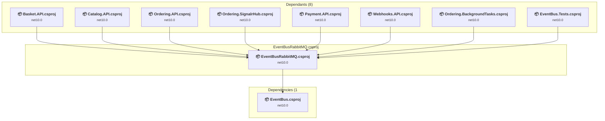

### API Compatibility

| Category | Count | Impact |
| :--- | :---: | :--- |
| 🔴 Binary Incompatible | 0 | High - Require code changes |
| 🟡 Source Incompatible | 0 | Medium - Needs re-compilation and potential conflicting API error fixing |
| 🔵 Behavioral change | 0 | Low - Behavioral changes that may require testing at runtime |
| ✅ Compatible | 0 |  |
| ***Total APIs Analyzed*** | ***0*** |  |

<a id="buildingblockseventbuseventbusservicebuseventbusservicebuscsproj"></a>
### BuildingBlocks\EventBus\EventBusServiceBus\EventBusServiceBus.csproj

#### Project Info

- **Current Target Framework:** net10.0✅
- **SDK-style**: True
- **Project Kind:** ClassLibrary
- **Dependencies**: 1
- **Dependants**: 7
- **Number of Files**: 4
- **Lines of Code**: 279
- **Estimated LOC to modify**: 0+ (at least 0,0% of the project)

#### Dependency Graph

Legend:
📦 SDK-style project
⚙️ Classic project

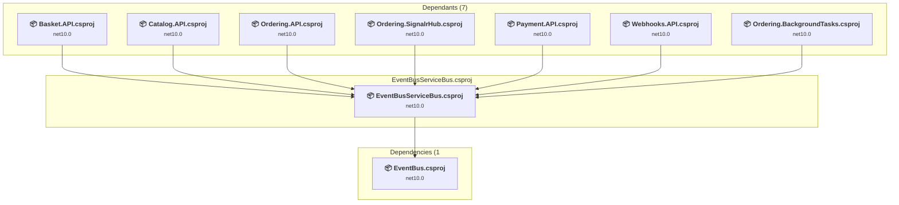

### API Compatibility

| Category | Count | Impact |
| :--- | :---: | :--- |
| 🔴 Binary Incompatible | 0 | High - Require code changes |
| 🟡 Source Incompatible | 0 | Medium - Needs re-compilation and potential conflicting API error fixing |
| 🔵 Behavioral change | 0 | Low - Behavioral changes that may require testing at runtime |
| ✅ Compatible | 0 |  |
| ***Total APIs Analyzed*** | ***0*** |  |

<a id="buildingblockseventbusintegrationeventlogefintegrationeventlogefcsproj"></a>
### BuildingBlocks\EventBus\IntegrationEventLogEF\IntegrationEventLogEF.csproj

#### Project Info

- **Current Target Framework:** net10.0✅
- **SDK-style**: True
- **Project Kind:** ClassLibrary
- **Dependencies**: 1
- **Dependants**: 4
- **Number of Files**: 7
- **Lines of Code**: 231
- **Estimated LOC to modify**: 0+ (at least 0,0% of the project)

#### Dependency Graph

Legend:
📦 SDK-style project
⚙️ Classic project

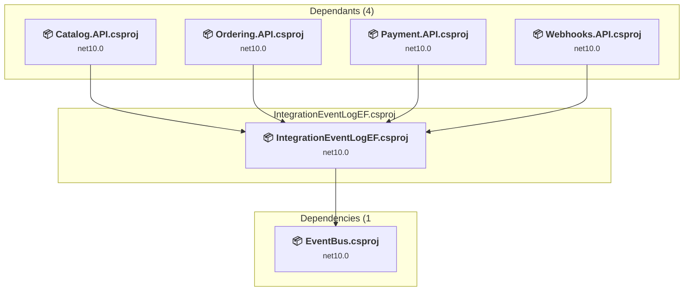

### API Compatibility

| Category | Count | Impact |
| :--- | :---: | :--- |
| 🔴 Binary Incompatible | 0 | High - Require code changes |
| 🟡 Source Incompatible | 0 | Medium - Needs re-compilation and potential conflicting API error fixing |
| 🔵 Behavioral change | 0 | Low - Behavioral changes that may require testing at runtime |
| ✅ Compatible | 0 |  |
| ***Total APIs Analyzed*** | ***0*** |  |

<a id="buildingblockswebhostcustomizationwebhostcustomizationwebhostcustomizationcsproj"></a>
### BuildingBlocks\WebHostCustomization\WebHost.Customization\WebHost.Customization.csproj

#### Project Info

- **Current Target Framework:** net10.0✅
- **SDK-style**: True
- **Project Kind:** ClassLibrary
- **Dependencies**: 0
- **Dependants**: 2
- **Number of Files**: 1
- **Lines of Code**: 77
- **Estimated LOC to modify**: 0+ (at least 0,0% of the project)

#### Dependency Graph

Legend:
📦 SDK-style project
⚙️ Classic project

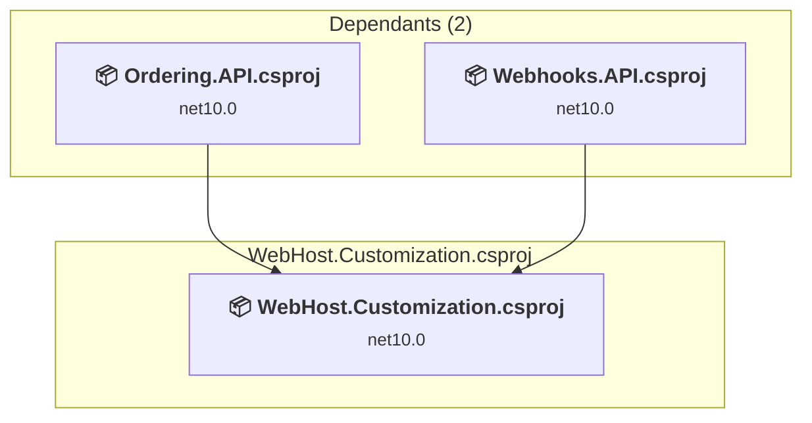

### API Compatibility

| Category | Count | Impact |
| :--- | :---: | :--- |
| 🔴 Binary Incompatible | 0 | High - Require code changes |
| 🟡 Source Incompatible | 0 | Medium - Needs re-compilation and potential conflicting API error fixing |
| 🔵 Behavioral change | 0 | Low - Behavioral changes that may require testing at runtime |
| ✅ Compatible | 0 |  |
| ***Total APIs Analyzed*** | ***0*** |  |

<a id="docker-composedcproj"></a>
### docker-compose.dcproj

#### Project Info

- **Current Target Framework:** ✅
- **SDK-style**: True
- **Project Kind:** DotNetCoreApp
- **Dependencies**: 0
- **Dependants**: 0
- **Number of Files**: 0
- **Lines of Code**: 0
- **Estimated LOC to modify**: 0+ (at least 0,0% of the project)

#### Dependency Graph

Legend:
📦 SDK-style project
⚙️ Classic project

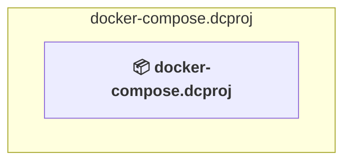

### API Compatibility

| Category | Count | Impact |
| :--- | :---: | :--- |
| 🔴 Binary Incompatible | 0 | High - Require code changes |
| 🟡 Source Incompatible | 0 | Medium - Needs re-compilation and potential conflicting API error fixing |
| 🔵 Behavioral change | 0 | Low - Behavioral changes that may require testing at runtime |
| ✅ Compatible | 0 |  |
| ***Total APIs Analyzed*** | ***0*** |  |

<a id="servicesbasketbasketapibasketapicsproj"></a>
### Services\Basket\Basket.API\Basket.API.csproj

#### Project Info

- **Current Target Framework:** net10.0✅
- **SDK-style**: True
- **Project Kind:** AspNetCore
- **Dependencies**: 3
- **Dependants**: 3
- **Number of Files**: 37
- **Lines of Code**: 1355
- **Estimated LOC to modify**: 0+ (at least 0,0% of the project)

#### Dependency Graph

Legend:
📦 SDK-style project
⚙️ Classic project

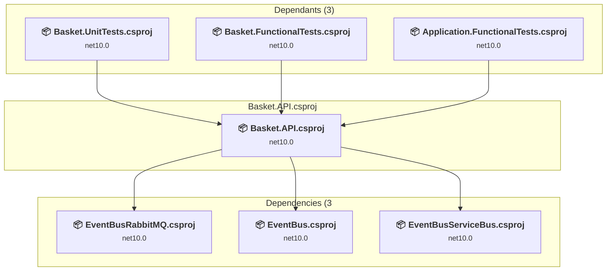

### API Compatibility

| Category | Count | Impact |
| :--- | :---: | :--- |
| 🔴 Binary Incompatible | 0 | High - Require code changes |
| 🟡 Source Incompatible | 0 | Medium - Needs re-compilation and potential conflicting API error fixing |
| 🔵 Behavioral change | 0 | Low - Behavioral changes that may require testing at runtime |
| ✅ Compatible | 0 |  |
| ***Total APIs Analyzed*** | ***0*** |  |

<a id="servicesbasketbasketfunctionaltestsbasketfunctionaltestscsproj"></a>
### Services\Basket\Basket.FunctionalTests\Basket.FunctionalTests.csproj

#### Project Info

- **Current Target Framework:** net10.0✅
- **SDK-style**: True
- **Project Kind:** DotNetCoreApp
- **Dependencies**: 1
- **Dependants**: 0
- **Number of Files**: 10
- **Lines of Code**: 282
- **Estimated LOC to modify**: 0+ (at least 0,0% of the project)

#### Dependency Graph

Legend:
📦 SDK-style project
⚙️ Classic project

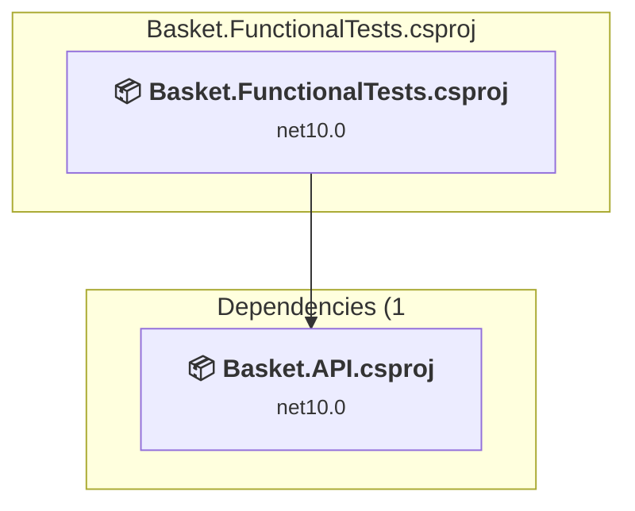

### API Compatibility

| Category | Count | Impact |
| :--- | :---: | :--- |
| 🔴 Binary Incompatible | 0 | High - Require code changes |
| 🟡 Source Incompatible | 0 | Medium - Needs re-compilation and potential conflicting API error fixing |
| 🔵 Behavioral change | 0 | Low - Behavioral changes that may require testing at runtime |
| ✅ Compatible | 0 |  |
| ***Total APIs Analyzed*** | ***0*** |  |

<a id="servicesbasketbasketunittestsbasketunittestscsproj"></a>
### Services\Basket\Basket.UnitTests\Basket.UnitTests.csproj

#### Project Info

- **Current Target Framework:** net10.0✅
- **SDK-style**: True
- **Project Kind:** DotNetCoreApp
- **Dependencies**: 2
- **Dependants**: 0
- **Number of Files**: 5
- **Lines of Code**: 276
- **Estimated LOC to modify**: 0+ (at least 0,0% of the project)

#### Dependency Graph

Legend:
📦 SDK-style project
⚙️ Classic project

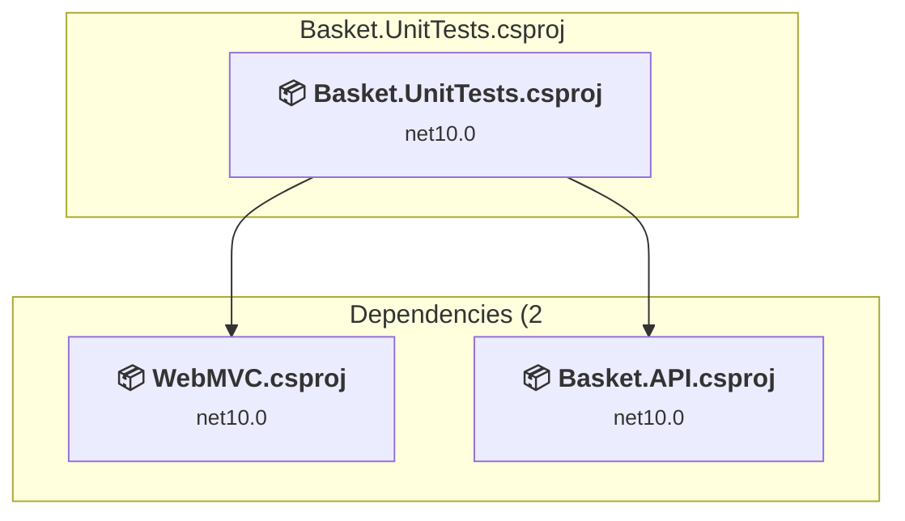

### API Compatibility

| Category | Count | Impact |
| :--- | :---: | :--- |
| 🔴 Binary Incompatible | 0 | High - Require code changes |
| 🟡 Source Incompatible | 0 | Medium - Needs re-compilation and potential conflicting API error fixing |
| 🔵 Behavioral change | 0 | Low - Behavioral changes that may require testing at runtime |
| ✅ Compatible | 0 |  |
| ***Total APIs Analyzed*** | ***0*** |  |

<a id="servicescatalogcatalogapicatalogapicsproj"></a>
### Services\Catalog\Catalog.API\Catalog.API.csproj

#### Project Info

- **Current Target Framework:** net10.0✅
- **SDK-style**: True
- **Project Kind:** AspNetCore
- **Dependencies**: 4
- **Dependants**: 3
- **Number of Files**: 81
- **Lines of Code**: 3811
- **Estimated LOC to modify**: 0+ (at least 0,0% of the project)

#### Dependency Graph

Legend:
📦 SDK-style project
⚙️ Classic project

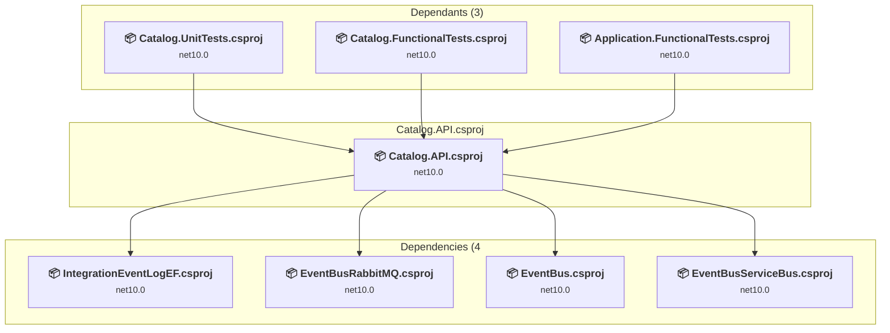

### API Compatibility

| Category | Count | Impact |
| :--- | :---: | :--- |
| 🔴 Binary Incompatible | 0 | High - Require code changes |
| 🟡 Source Incompatible | 0 | Medium - Needs re-compilation and potential conflicting API error fixing |
| 🔵 Behavioral change | 0 | Low - Behavioral changes that may require testing at runtime |
| ✅ Compatible | 0 |  |
| ***Total APIs Analyzed*** | ***0*** |  |

<a id="servicescatalogcatalogfunctionaltestscatalogfunctionaltestscsproj"></a>
### Services\Catalog\Catalog.FunctionalTests\Catalog.FunctionalTests.csproj

#### Project Info

- **Current Target Framework:** net10.0✅
- **SDK-style**: True
- **Project Kind:** DotNetCoreApp
- **Dependencies**: 1
- **Dependants**: 0
- **Number of Files**: 10
- **Lines of Code**: 212
- **Estimated LOC to modify**: 0+ (at least 0,0% of the project)

#### Dependency Graph

Legend:
📦 SDK-style project
⚙️ Classic project

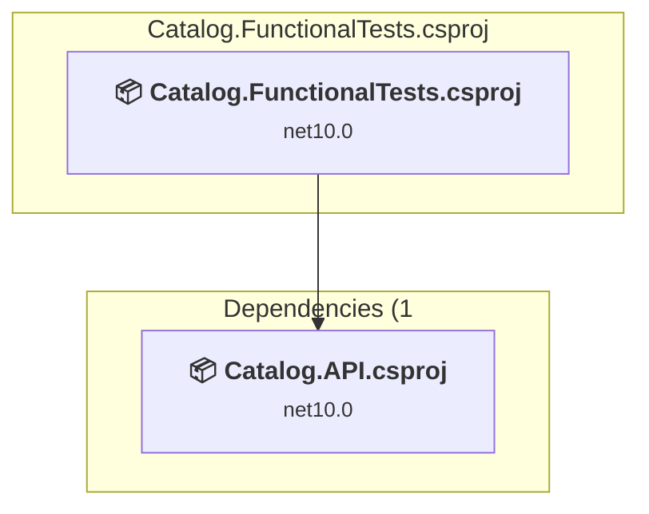

### API Compatibility

| Category | Count | Impact |
| :--- | :---: | :--- |
| 🔴 Binary Incompatible | 0 | High - Require code changes |
| 🟡 Source Incompatible | 0 | Medium - Needs re-compilation and potential conflicting API error fixing |
| 🔵 Behavioral change | 0 | Low - Behavioral changes that may require testing at runtime |
| ✅ Compatible | 0 |  |
| ***Total APIs Analyzed*** | ***0*** |  |

<a id="servicescatalogcatalogunittestscatalogunittestscsproj"></a>
### Services\Catalog\Catalog.UnitTests\Catalog.UnitTests.csproj

#### Project Info

- **Current Target Framework:** net10.0✅
- **SDK-style**: True
- **Project Kind:** DotNetCoreApp
- **Dependencies**: 1
- **Dependants**: 0
- **Number of Files**: 3
- **Lines of Code**: 128
- **Estimated LOC to modify**: 0+ (at least 0,0% of the project)

#### Dependency Graph

Legend:
📦 SDK-style project
⚙️ Classic project

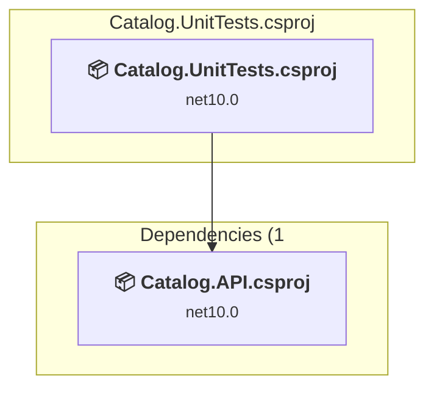

### API Compatibility

| Category | Count | Impact |
| :--- | :---: | :--- |
| 🔴 Binary Incompatible | 0 | High - Require code changes |
| 🟡 Source Incompatible | 0 | Medium - Needs re-compilation and potential conflicting API error fixing |
| 🔵 Behavioral change | 0 | Low - Behavioral changes that may require testing at runtime |
| ✅ Compatible | 0 |  |
| ***Total APIs Analyzed*** | ***0*** |  |

<a id="servicesidentityidentityapiidentityapicsproj"></a>
### Services\Identity\Identity.API\Identity.API.csproj

#### Project Info

- **Current Target Framework:** net10.0✅
- **SDK-style**: True
- **Project Kind:** AspNetCore
- **Dependencies**: 0
- **Dependants**: 0
- **Number of Files**: 166
- **Lines of Code**: 4575
- **Estimated LOC to modify**: 0+ (at least 0,0% of the project)

#### Dependency Graph

Legend:
📦 SDK-style project
⚙️ Classic project

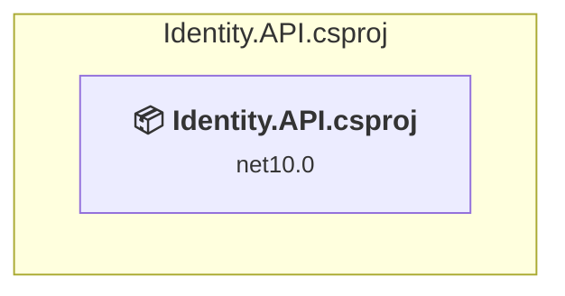

### API Compatibility

| Category | Count | Impact |
| :--- | :---: | :--- |
| 🔴 Binary Incompatible | 0 | High - Require code changes |
| 🟡 Source Incompatible | 0 | Medium - Needs re-compilation and potential conflicting API error fixing |
| 🔵 Behavioral change | 0 | Low - Behavioral changes that may require testing at runtime |
| ✅ Compatible | 0 |  |
| ***Total APIs Analyzed*** | ***0*** |  |

<a id="servicesorderingorderingapiorderingapicsproj"></a>
### Services\Ordering\Ordering.API\Ordering.API.csproj

#### Project Info

- **Current Target Framework:** net10.0✅
- **SDK-style**: True
- **Project Kind:** AspNetCore
- **Dependencies**: 7
- **Dependants**: 3
- **Number of Files**: 108
- **Lines of Code**: 6623
- **Estimated LOC to modify**: 0+ (at least 0,0% of the project)

#### Dependency Graph

Legend:
📦 SDK-style project
⚙️ Classic project

```mermaid
flowchart TB
    subgraph upstream["Dependants (3)"]
        P21["<b>📦&nbsp;Ordering.UnitTests.csproj</b><br/><small>net10.0</small>"]
        P23["<b>📦&nbsp;Ordering.FunctionalTests.csproj</b><br/><small>net10.0</small>"]
        P24["<b>📦&nbsp;Application.FunctionalTests.csproj</b><br/><small>net10.0</small>"]
        click P21 "#servicesorderingorderingunittestsorderingunittestscsproj"
        click P23 "#servicesorderingorderingfunctionaltestsorderingfunctionaltestscsproj"
        click P24 "#testsservicesapplicationfunctionaltestsapplicationfunctionaltestscsproj"
    end
    subgraph current["Ordering.API.csproj"]
        MAIN["<b>📦&nbsp;Ordering.API.csproj</b><br/><small>net10.0</small>"]
        click MAIN "#servicesorderingorderingapiorderingapicsproj"
    end
    subgraph downstream["Dependencies (7"]
        P12["<b>📦&nbsp;IntegrationEventLogEF.csproj</b><br/><small>net10.0</small>"]
        P11["<b>📦&nbsp;EventBusRabbitMQ.csproj</b><br/><small>net10.0</small>"]
        P10["<b>📦&nbsp;EventBus.csproj</b><br/><small>net10.0</small>"]
        P14["<b>📦&nbsp;EventBusServiceBus.csproj</b><br/><small>net10.0</small>"]
        P5["<b>📦&nbsp;Ordering.Domain.csproj</b><br/><small>net10.0</small>"]
        P15["<b>📦&nbsp;WebHost.Customization.csproj</b><br/><small>net10.0</small>"]
        P7["<b>📦&nbsp;Ordering.Infrastructure.csproj</b><br/><small>net10.0</small>"]
        click P12 "#buildingblockseventbusintegrationeventlogefintegrationeventlogefcsproj"
        click P11 "#buildingblockseventbuseventbusrabbitmqeventbusrabbitmqcsproj"
        click P10 "#buildingblockseventbuseventbuseventbuscsproj"
        click P14 "#buildingblockseventbuseventbusservicebuseventbusservicebuscsproj"
        click P5 "#servicesorderingorderingdomainorderingdomaincsproj"
        click P15 "#buildingblockswebhostcustomizationwebhostcustomizationwebhostcustomizationcsproj"
        click P7 "#servicesorderingorderinginfrastructureorderinginfrastructurecsproj"
    end
    P21 --> MAIN
    P23 --> MAIN
    P24 --> MAIN
    MAIN --> P12
    MAIN --> P11
    MAIN --> P10
    MAIN --> P14
    MAIN --> P5
    MAIN --> P15
    MAIN --> P7

```

### API Compatibility

| Category | Count | Impact |
| :--- | :---: | :--- |
| 🔴 Binary Incompatible | 0 | High - Require code changes |
| 🟡 Source Incompatible | 0 | Medium - Needs re-compilation and potential conflicting API error fixing |
| 🔵 Behavioral change | 0 | Low - Behavioral changes that may require testing at runtime |
| ✅ Compatible | 0 |  |
| ***Total APIs Analyzed*** | ***0*** |  |

<a id="servicesorderingorderingbackgroundtasksorderingbackgroundtaskscsproj"></a>
### Services\Ordering\Ordering.BackgroundTasks\Ordering.BackgroundTasks.csproj

#### Project Info

- **Current Target Framework:** net10.0✅
- **SDK-style**: True
- **Project Kind:** DotNetCoreApp
- **Dependencies**: 3
- **Dependants**: 0
- **Number of Files**: 8
- **Lines of Code**: 340
- **Estimated LOC to modify**: 0+ (at least 0,0% of the project)

#### Dependency Graph

Legend:
📦 SDK-style project
⚙️ Classic project

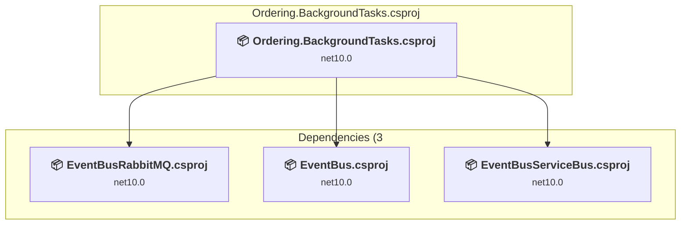

### API Compatibility

| Category | Count | Impact |
| :--- | :---: | :--- |
| 🔴 Binary Incompatible | 0 | High - Require code changes |
| 🟡 Source Incompatible | 0 | Medium - Needs re-compilation and potential conflicting API error fixing |
| 🔵 Behavioral change | 0 | Low - Behavioral changes that may require testing at runtime |
| ✅ Compatible | 0 |  |
| ***Total APIs Analyzed*** | ***0*** |  |

<a id="servicesorderingorderingdomainorderingdomaincsproj"></a>
### Services\Ordering\Ordering.Domain\Ordering.Domain.csproj

#### Project Info

- **Current Target Framework:** net10.0✅
- **SDK-style**: True
- **Project Kind:** ClassLibrary
- **Dependencies**: 0
- **Dependants**: 4
- **Number of Files**: 24
- **Lines of Code**: 852
- **Estimated LOC to modify**: 0+ (at least 0,0% of the project)

#### Dependency Graph

Legend:
📦 SDK-style project
⚙️ Classic project

```mermaid
flowchart TB
    subgraph upstream["Dependants (4)"]
        P4["<b>📦&nbsp;Ordering.API.csproj</b><br/><small>net10.0</small>"]
        P7["<b>📦&nbsp;Ordering.Infrastructure.csproj</b><br/><small>net10.0</small>"]
        P21["<b>📦&nbsp;Ordering.UnitTests.csproj</b><br/><small>net10.0</small>"]
        P23["<b>📦&nbsp;Ordering.FunctionalTests.csproj</b><br/><small>net10.0</small>"]
        click P4 "#servicesorderingorderingapiorderingapicsproj"
        click P7 "#servicesorderingorderinginfrastructureorderinginfrastructurecsproj"
        click P21 "#servicesorderingorderingunittestsorderingunittestscsproj"
        click P23 "#servicesorderingorderingfunctionaltestsorderingfunctionaltestscsproj"
    end
    subgraph current["Ordering.Domain.csproj"]
        MAIN["<b>📦&nbsp;Ordering.Domain.csproj</b><br/><small>net10.0</small>"]
        click MAIN "#servicesorderingorderingdomainorderingdomaincsproj"
    end
    P4 --> MAIN
    P7 --> MAIN
    P21 --> MAIN
    P23 --> MAIN

```

### API Compatibility

| Category | Count | Impact |
| :--- | :---: | :--- |
| 🔴 Binary Incompatible | 0 | High - Require code changes |
| 🟡 Source Incompatible | 0 | Medium - Needs re-compilation and potential conflicting API error fixing |
| 🔵 Behavioral change | 0 | Low - Behavioral changes that may require testing at runtime |
| ✅ Compatible | 0 |  |
| ***Total APIs Analyzed*** | ***0*** |  |

<a id="servicesorderingorderingfunctionaltestsorderingfunctionaltestscsproj"></a>
### Services\Ordering\Ordering.FunctionalTests\Ordering.FunctionalTests.csproj

#### Project Info

- **Current Target Framework:** net10.0✅
- **SDK-style**: True
- **Project Kind:** DotNetCoreApp
- **Dependencies**: 4
- **Dependants**: 0
- **Number of Files**: 9
- **Lines of Code**: 189
- **Estimated LOC to modify**: 0+ (at least 0,0% of the project)

#### Dependency Graph

Legend:
📦 SDK-style project
⚙️ Classic project

```mermaid
flowchart TB
    subgraph current["Ordering.FunctionalTests.csproj"]
        MAIN["<b>📦&nbsp;Ordering.FunctionalTests.csproj</b><br/><small>net10.0</small>"]
        click MAIN "#servicesorderingorderingfunctionaltestsorderingfunctionaltestscsproj"
    end
    subgraph downstream["Dependencies (4"]
        P6["<b>📦&nbsp;WebMVC.csproj</b><br/><small>net10.0</small>"]
        P4["<b>📦&nbsp;Ordering.API.csproj</b><br/><small>net10.0</small>"]
        P5["<b>📦&nbsp;Ordering.Domain.csproj</b><br/><small>net10.0</small>"]
        P7["<b>📦&nbsp;Ordering.Infrastructure.csproj</b><br/><small>net10.0</small>"]
        click P6 "#webwebmvcwebmvccsproj"
        click P4 "#servicesorderingorderingapiorderingapicsproj"
        click P5 "#servicesorderingorderingdomainorderingdomaincsproj"
        click P7 "#servicesorderingorderinginfrastructureorderinginfrastructurecsproj"
    end
    MAIN --> P6
    MAIN --> P4
    MAIN --> P5
    MAIN --> P7

```

### API Compatibility

| Category | Count | Impact |
| :--- | :---: | :--- |
| 🔴 Binary Incompatible | 0 | High - Require code changes |
| 🟡 Source Incompatible | 0 | Medium - Needs re-compilation and potential conflicting API error fixing |
| 🔵 Behavioral change | 0 | Low - Behavioral changes that may require testing at runtime |
| ✅ Compatible | 0 |  |
| ***Total APIs Analyzed*** | ***0*** |  |

<a id="servicesorderingorderinginfrastructureorderinginfrastructurecsproj"></a>
### Services\Ordering\Ordering.Infrastructure\Ordering.Infrastructure.csproj

#### Project Info

- **Current Target Framework:** net10.0✅
- **SDK-style**: True
- **Project Kind:** ClassLibrary
- **Dependencies**: 1
- **Dependants**: 3
- **Number of Files**: 15
- **Lines of Code**: 629
- **Estimated LOC to modify**: 0+ (at least 0,0% of the project)

#### Dependency Graph

Legend:
📦 SDK-style project
⚙️ Classic project

```mermaid
flowchart TB
    subgraph upstream["Dependants (3)"]
        P4["<b>📦&nbsp;Ordering.API.csproj</b><br/><small>net10.0</small>"]
        P21["<b>📦&nbsp;Ordering.UnitTests.csproj</b><br/><small>net10.0</small>"]
        P23["<b>📦&nbsp;Ordering.FunctionalTests.csproj</b><br/><small>net10.0</small>"]
        click P4 "#servicesorderingorderingapiorderingapicsproj"
        click P21 "#servicesorderingorderingunittestsorderingunittestscsproj"
        click P23 "#servicesorderingorderingfunctionaltestsorderingfunctionaltestscsproj"
    end
    subgraph current["Ordering.Infrastructure.csproj"]
        MAIN["<b>📦&nbsp;Ordering.Infrastructure.csproj</b><br/><small>net10.0</small>"]
        click MAIN "#servicesorderingorderinginfrastructureorderinginfrastructurecsproj"
    end
    subgraph downstream["Dependencies (1"]
        P5["<b>📦&nbsp;Ordering.Domain.csproj</b><br/><small>net10.0</small>"]
        click P5 "#servicesorderingorderingdomainorderingdomaincsproj"
    end
    P4 --> MAIN
    P21 --> MAIN
    P23 --> MAIN
    MAIN --> P5

```

### API Compatibility

| Category | Count | Impact |
| :--- | :---: | :--- |
| 🔴 Binary Incompatible | 0 | High - Require code changes |
| 🟡 Source Incompatible | 0 | Medium - Needs re-compilation and potential conflicting API error fixing |
| 🔵 Behavioral change | 0 | Low - Behavioral changes that may require testing at runtime |
| ✅ Compatible | 0 |  |
| ***Total APIs Analyzed*** | ***0*** |  |

<a id="servicesorderingorderingsignalrhuborderingsignalrhubcsproj"></a>
### Services\Ordering\Ordering.SignalrHub\Ordering.SignalrHub.csproj

#### Project Info

- **Current Target Framework:** net10.0✅
- **SDK-style**: True
- **Project Kind:** AspNetCore
- **Dependencies**: 3
- **Dependants**: 0
- **Number of Files**: 18
- **Lines of Code**: 653
- **Estimated LOC to modify**: 0+ (at least 0,0% of the project)

#### Dependency Graph

Legend:
📦 SDK-style project
⚙️ Classic project

```mermaid
flowchart TB
    subgraph current["Ordering.SignalrHub.csproj"]
        MAIN["<b>📦&nbsp;Ordering.SignalrHub.csproj</b><br/><small>net10.0</small>"]
        click MAIN "#servicesorderingorderingsignalrhuborderingsignalrhubcsproj"
    end
    subgraph downstream["Dependencies (3"]
        P11["<b>📦&nbsp;EventBusRabbitMQ.csproj</b><br/><small>net10.0</small>"]
        P10["<b>📦&nbsp;EventBus.csproj</b><br/><small>net10.0</small>"]
        P14["<b>📦&nbsp;EventBusServiceBus.csproj</b><br/><small>net10.0</small>"]
        click P11 "#buildingblockseventbuseventbusrabbitmqeventbusrabbitmqcsproj"
        click P10 "#buildingblockseventbuseventbuseventbuscsproj"
        click P14 "#buildingblockseventbuseventbusservicebuseventbusservicebuscsproj"
    end
    MAIN --> P11
    MAIN --> P10
    MAIN --> P14

```

### API Compatibility

| Category | Count | Impact |
| :--- | :---: | :--- |
| 🔴 Binary Incompatible | 0 | High - Require code changes |
| 🟡 Source Incompatible | 0 | Medium - Needs re-compilation and potential conflicting API error fixing |
| 🔵 Behavioral change | 0 | Low - Behavioral changes that may require testing at runtime |
| ✅ Compatible | 0 |  |
| ***Total APIs Analyzed*** | ***0*** |  |

<a id="servicesorderingorderingunittestsorderingunittestscsproj"></a>
### Services\Ordering\Ordering.UnitTests\Ordering.UnitTests.csproj

#### Project Info

- **Current Target Framework:** net10.0✅
- **SDK-style**: True
- **Project Kind:** DotNetCoreApp
- **Dependencies**: 3
- **Dependants**: 0
- **Number of Files**: 10
- **Lines of Code**: 849
- **Estimated LOC to modify**: 0+ (at least 0,0% of the project)

#### Dependency Graph

Legend:
📦 SDK-style project
⚙️ Classic project

```mermaid
flowchart TB
    subgraph current["Ordering.UnitTests.csproj"]
        MAIN["<b>📦&nbsp;Ordering.UnitTests.csproj</b><br/><small>net10.0</small>"]
        click MAIN "#servicesorderingorderingunittestsorderingunittestscsproj"
    end
    subgraph downstream["Dependencies (3"]
        P4["<b>📦&nbsp;Ordering.API.csproj</b><br/><small>net10.0</small>"]
        P5["<b>📦&nbsp;Ordering.Domain.csproj</b><br/><small>net10.0</small>"]
        P7["<b>📦&nbsp;Ordering.Infrastructure.csproj</b><br/><small>net10.0</small>"]
        click P4 "#servicesorderingorderingapiorderingapicsproj"
        click P5 "#servicesorderingorderingdomainorderingdomaincsproj"
        click P7 "#servicesorderingorderinginfrastructureorderinginfrastructurecsproj"
    end
    MAIN --> P4
    MAIN --> P5
    MAIN --> P7

```

### API Compatibility

| Category | Count | Impact |
| :--- | :---: | :--- |
| 🔴 Binary Incompatible | 0 | High - Require code changes |
| 🟡 Source Incompatible | 0 | Medium - Needs re-compilation and potential conflicting API error fixing |
| 🔵 Behavioral change | 0 | Low - Behavioral changes that may require testing at runtime |
| ✅ Compatible | 0 |  |
| ***Total APIs Analyzed*** | ***0*** |  |

<a id="servicespaymentpaymentapipaymentapicsproj"></a>
### Services\Payment\Payment.API\Payment.API.csproj

#### Project Info

- **Current Target Framework:** net10.0✅
- **SDK-style**: True
- **Project Kind:** AspNetCore
- **Dependencies**: 4
- **Dependants**: 0
- **Number of Files**: 10
- **Lines of Code**: 366
- **Estimated LOC to modify**: 0+ (at least 0,0% of the project)

#### Dependency Graph

Legend:
📦 SDK-style project
⚙️ Classic project

```mermaid
flowchart TB
    subgraph current["Payment.API.csproj"]
        MAIN["<b>📦&nbsp;Payment.API.csproj</b><br/><small>net10.0</small>"]
        click MAIN "#servicespaymentpaymentapipaymentapicsproj"
    end
    subgraph downstream["Dependencies (4"]
        P12["<b>📦&nbsp;IntegrationEventLogEF.csproj</b><br/><small>net10.0</small>"]
        P11["<b>📦&nbsp;EventBusRabbitMQ.csproj</b><br/><small>net10.0</small>"]
        P10["<b>📦&nbsp;EventBus.csproj</b><br/><small>net10.0</small>"]
        P14["<b>📦&nbsp;EventBusServiceBus.csproj</b><br/><small>net10.0</small>"]
        click P12 "#buildingblockseventbusintegrationeventlogefintegrationeventlogefcsproj"
        click P11 "#buildingblockseventbuseventbusrabbitmqeventbusrabbitmqcsproj"
        click P10 "#buildingblockseventbuseventbuseventbuscsproj"
        click P14 "#buildingblockseventbuseventbusservicebuseventbusservicebuscsproj"
    end
    MAIN --> P12
    MAIN --> P11
    MAIN --> P10
    MAIN --> P14

```

### API Compatibility

| Category | Count | Impact |
| :--- | :---: | :--- |
| 🔴 Binary Incompatible | 0 | High - Require code changes |
| 🟡 Source Incompatible | 0 | Medium - Needs re-compilation and potential conflicting API error fixing |
| 🔵 Behavioral change | 0 | Low - Behavioral changes that may require testing at runtime |
| ✅ Compatible | 0 |  |
| ***Total APIs Analyzed*** | ***0*** |  |

<a id="serviceswebhookswebhooksapiwebhooksapicsproj"></a>
### Services\Webhooks\Webhooks.API\Webhooks.API.csproj

#### Project Info

- **Current Target Framework:** net10.0✅
- **SDK-style**: True
- **Project Kind:** AspNetCore
- **Dependencies**: 6
- **Dependants**: 0
- **Number of Files**: 33
- **Lines of Code**: 1076
- **Estimated LOC to modify**: 0+ (at least 0,0% of the project)

#### Dependency Graph

Legend:
📦 SDK-style project
⚙️ Classic project

```mermaid
flowchart TB
    subgraph current["Webhooks.API.csproj"]
        MAIN["<b>📦&nbsp;Webhooks.API.csproj</b><br/><small>net10.0</small>"]
        click MAIN "#serviceswebhookswebhooksapiwebhooksapicsproj"
    end
    subgraph downstream["Dependencies (6"]
        P12["<b>📦&nbsp;IntegrationEventLogEF.csproj</b><br/><small>net10.0</small>"]
        P11["<b>📦&nbsp;EventBusRabbitMQ.csproj</b><br/><small>net10.0</small>"]
        P10["<b>📦&nbsp;EventBus.csproj</b><br/><small>net10.0</small>"]
        P28["<b>📦&nbsp;Devspaces.Support.csproj</b><br/><small>net10.0</small>"]
        P14["<b>📦&nbsp;EventBusServiceBus.csproj</b><br/><small>net10.0</small>"]
        P15["<b>📦&nbsp;WebHost.Customization.csproj</b><br/><small>net10.0</small>"]
        click P12 "#buildingblockseventbusintegrationeventlogefintegrationeventlogefcsproj"
        click P11 "#buildingblockseventbuseventbusrabbitmqeventbusrabbitmqcsproj"
        click P10 "#buildingblockseventbuseventbuseventbuscsproj"
        click P28 "#buildingblocksdevspacessupportdevspacessupportcsproj"
        click P14 "#buildingblockseventbuseventbusservicebuseventbusservicebuscsproj"
        click P15 "#buildingblockswebhostcustomizationwebhostcustomizationwebhostcustomizationcsproj"
    end
    MAIN --> P12
    MAIN --> P11
    MAIN --> P10
    MAIN --> P28
    MAIN --> P14
    MAIN --> P15

```

### API Compatibility

| Category | Count | Impact |
| :--- | :---: | :--- |
| 🔴 Binary Incompatible | 0 | High - Require code changes |
| 🟡 Source Incompatible | 0 | Medium - Needs re-compilation and potential conflicting API error fixing |
| 🔵 Behavioral change | 0 | Low - Behavioral changes that may require testing at runtime |
| ✅ Compatible | 0 |  |
| ***Total APIs Analyzed*** | ***0*** |  |

<a id="testsservicesapplicationfunctionaltestsapplicationfunctionaltestscsproj"></a>
### Tests\Services\Application.FunctionalTests\Application.FunctionalTests.csproj

#### Project Info

- **Current Target Framework:** net10.0✅
- **SDK-style**: True
- **Project Kind:** DotNetCoreApp
- **Dependencies**: 4
- **Dependants**: 0
- **Number of Files**: 19
- **Lines of Code**: 532
- **Estimated LOC to modify**: 0+ (at least 0,0% of the project)

#### Dependency Graph

Legend:
📦 SDK-style project
⚙️ Classic project

```mermaid
flowchart TB
    subgraph current["Application.FunctionalTests.csproj"]
        MAIN["<b>📦&nbsp;Application.FunctionalTests.csproj</b><br/><small>net10.0</small>"]
        click MAIN "#testsservicesapplicationfunctionaltestsapplicationfunctionaltestscsproj"
    end
    subgraph downstream["Dependencies (4"]
        P6["<b>📦&nbsp;WebMVC.csproj</b><br/><small>net10.0</small>"]
        P3["<b>📦&nbsp;Catalog.API.csproj</b><br/><small>net10.0</small>"]
        P2["<b>📦&nbsp;Basket.API.csproj</b><br/><small>net10.0</small>"]
        P4["<b>📦&nbsp;Ordering.API.csproj</b><br/><small>net10.0</small>"]
        click P6 "#webwebmvcwebmvccsproj"
        click P3 "#servicescatalogcatalogapicatalogapicsproj"
        click P2 "#servicesbasketbasketapibasketapicsproj"
        click P4 "#servicesorderingorderingapiorderingapicsproj"
    end
    MAIN --> P6
    MAIN --> P3
    MAIN --> P2
    MAIN --> P4

```

### API Compatibility

| Category | Count | Impact |
| :--- | :---: | :--- |
| 🔴 Binary Incompatible | 0 | High - Require code changes |
| 🟡 Source Incompatible | 0 | Medium - Needs re-compilation and potential conflicting API error fixing |
| 🔵 Behavioral change | 0 | Low - Behavioral changes that may require testing at runtime |
| ✅ Compatible | 0 |  |
| ***Total APIs Analyzed*** | ***0*** |  |

<a id="webwebhookclientwebhookclientcsproj"></a>
### Web\WebhookClient\WebhookClient.csproj

#### Project Info

- **Current Target Framework:** net10.0✅
- **SDK-style**: True
- **Project Kind:** AspNetCore
- **Dependencies**: 0
- **Dependants**: 0
- **Number of Files**: 37
- **Lines of Code**: 789
- **Estimated LOC to modify**: 0+ (at least 0,0% of the project)

#### Dependency Graph

Legend:
📦 SDK-style project
⚙️ Classic project

```mermaid
flowchart TB
    subgraph current["WebhookClient.csproj"]
        MAIN["<b>📦&nbsp;WebhookClient.csproj</b><br/><small>net10.0</small>"]
        click MAIN "#webwebhookclientwebhookclientcsproj"
    end

```

### API Compatibility

| Category | Count | Impact |
| :--- | :---: | :--- |
| 🔴 Binary Incompatible | 0 | High - Require code changes |
| 🟡 Source Incompatible | 0 | Medium - Needs re-compilation and potential conflicting API error fixing |
| 🔵 Behavioral change | 0 | Low - Behavioral changes that may require testing at runtime |
| ✅ Compatible | 0 |  |
| ***Total APIs Analyzed*** | ***0*** |  |

<a id="webwebmvcwebmvccsproj"></a>
### Web\WebMVC\WebMVC.csproj

#### Project Info

- **Current Target Framework:** net10.0✅
- **SDK-style**: True
- **Project Kind:** AspNetCore
- **Dependencies**: 1
- **Dependants**: 3
- **Number of Files**: 135
- **Lines of Code**: 2634
- **Estimated LOC to modify**: 0+ (at least 0,0% of the project)

#### Dependency Graph

Legend:
📦 SDK-style project
⚙️ Classic project

```mermaid
flowchart TB
    subgraph upstream["Dependants (3)"]
        P18["<b>📦&nbsp;Basket.UnitTests.csproj</b><br/><small>net10.0</small>"]
        P23["<b>📦&nbsp;Ordering.FunctionalTests.csproj</b><br/><small>net10.0</small>"]
        P24["<b>📦&nbsp;Application.FunctionalTests.csproj</b><br/><small>net10.0</small>"]
        click P18 "#servicesbasketbasketunittestsbasketunittestscsproj"
        click P23 "#servicesorderingorderingfunctionaltestsorderingfunctionaltestscsproj"
        click P24 "#testsservicesapplicationfunctionaltestsapplicationfunctionaltestscsproj"
    end
    subgraph current["WebMVC.csproj"]
        MAIN["<b>📦&nbsp;WebMVC.csproj</b><br/><small>net10.0</small>"]
        click MAIN "#webwebmvcwebmvccsproj"
    end
    subgraph downstream["Dependencies (1"]
        P28["<b>📦&nbsp;Devspaces.Support.csproj</b><br/><small>net10.0</small>"]
        click P28 "#buildingblocksdevspacessupportdevspacessupportcsproj"
    end
    P18 --> MAIN
    P23 --> MAIN
    P24 --> MAIN
    MAIN --> P28

```

### API Compatibility

| Category | Count | Impact |
| :--- | :---: | :--- |
| 🔴 Binary Incompatible | 0 | High - Require code changes |
| 🟡 Source Incompatible | 0 | Medium - Needs re-compilation and potential conflicting API error fixing |
| 🔵 Behavioral change | 0 | Low - Behavioral changes that may require testing at runtime |
| ✅ Compatible | 0 |  |
| ***Total APIs Analyzed*** | ***0*** |  |

<a id="webwebspawebspacsproj"></a>
### Web\WebSPA\WebSPA.csproj

#### Project Info

- **Current Target Framework:** net10.0✅
- **SDK-style**: True
- **Project Kind:** AspNetCore
- **Dependencies**: 0
- **Dependants**: 0
- **Number of Files**: 18
- **Lines of Code**: 308
- **Estimated LOC to modify**: 0+ (at least 0,0% of the project)

#### Dependency Graph

Legend:
📦 SDK-style project
⚙️ Classic project

```mermaid
flowchart TB
    subgraph current["WebSPA.csproj"]
        MAIN["<b>📦&nbsp;WebSPA.csproj</b><br/><small>net10.0</small>"]
        click MAIN "#webwebspawebspacsproj"
    end

```

### API Compatibility

| Category | Count | Impact |
| :--- | :---: | :--- |
| 🔴 Binary Incompatible | 0 | High - Require code changes |
| 🟡 Source Incompatible | 0 | Medium - Needs re-compilation and potential conflicting API error fixing |
| 🔵 Behavioral change | 0 | Low - Behavioral changes that may require testing at runtime |
| ✅ Compatible | 0 |  |
| ***Total APIs Analyzed*** | ***0*** |  |

<a id="webwebstatuswebstatuscsproj"></a>
### Web\WebStatus\WebStatus.csproj

#### Project Info

- **Current Target Framework:** net10.0✅
- **SDK-style**: True
- **Project Kind:** AspNetCore
- **Dependencies**: 0
- **Dependants**: 0
- **Number of Files**: 12
- **Lines of Code**: 296
- **Estimated LOC to modify**: 0+ (at least 0,0% of the project)

#### Dependency Graph

Legend:
📦 SDK-style project
⚙️ Classic project

```mermaid
flowchart TB
    subgraph current["WebStatus.csproj"]
        MAIN["<b>📦&nbsp;WebStatus.csproj</b><br/><small>net10.0</small>"]
        click MAIN "#webwebstatuswebstatuscsproj"
    end

```

### API Compatibility

| Category | Count | Impact |
| :--- | :---: | :--- |
| 🔴 Binary Incompatible | 0 | High - Require code changes |
| 🟡 Source Incompatible | 0 | Medium - Needs re-compilation and potential conflicting API error fixing |
| 🔵 Behavioral change | 0 | Low - Behavioral changes that may require testing at runtime |
| ✅ Compatible | 0 |  |
| ***Total APIs Analyzed*** | ***0*** |  |

